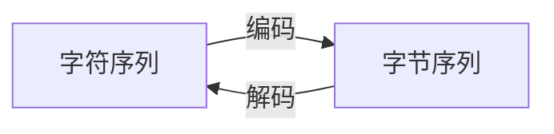
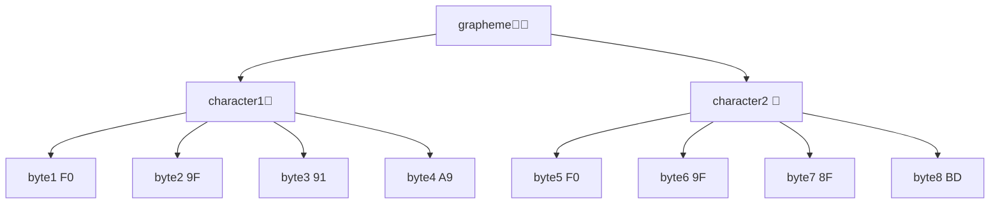

import Tabs from '@theme/Tabs';
import TabItem from '@theme/TabItem';

# 字节字符字素字字珠玑

<!--truncate-->

## 什么是字符集？

字符的集合就叫字符集（character set）。字符在字符集中分配的编号叫做码位或码点（code point）。

例如 $S=\{\text{你,好,世,界}\}$ 就是一个只有四个字符的字符集。我们可以给这四个字符的分配码位 $0,1,2,3$，但码位的分配实际上不一定连续或从零开始，因此也可以是 $2,3,5,7$，或是任意四个互不相同的自然数。但要注意，字符相同，但是字符对应码位不同的字符集不是相同的字符集。

## 什么是编码？

字符集中的字符（character）与码元（code unit）序列之间的映射 $f$ 叫字符集的编码（encoding）。同一个字符集可以有多个编码方案。

码元是编码序列的最小单位，被作为一个整体识别。可以是一个字节（byte），也可以是多个字节。

例如我们给出一些上面提到字符集可能的编码方案：

| 编码结果（十六进制）                     | 一个字符包含码元数 | 一个码元包含字节数 | 采用该模式的编码 |
| ---------------------------------------- | ------------------ | ------------------ | ---------------- |
| `00`、`01`、`02`、`03`                   | 一个               | 一个               | ASCII            |
| `00`、`01 00`、`01 01 00`、`01 01 01 00` | 一个或多个         | 一个               | UTF-8            |
| `0000`、`0001`、`1000 0000`、`1000 0001` | 一个或多个         | 两个               | UTF-16           |

需要注意，当码元为多个字节时，还需要考虑大小端（endianness）时不同的字节表示。例如 `0001` 可能被表示为 `00` `01` （BE）或者 `01` `00` （LE）的字节序列。

上面的例子表明：

- 编码将字符映射到的是码元序列，不只是单个码元，更不是单个字节。
- 字符的码位和编码是两个不同的概念，但字符的码位可以作为编码的依据。
- 同一码位的字符在不同编码方案下得到的码元序列可能不同。
- 同一码元在不同大小端的模式下得到的字节序列也可能不同。

## 什么是解码？

中文里，编码不仅是名词，也是动词。动词编码（encode）的反义词是解码（decode）。其反应的过程如下所示。



字符是编码、解码的最小单位。即对于字符序列 $c_1c_2\dots c_{n}$ 有且仅有一个对应的字节序列 $f(c_1)f(c_2)\dots f(c_{n})$，因此编码器（encoder）只需要实现一个字符到字节序列的编码即可实现字符序列的编码。同理，解码器（decoder）也只需要解码出字节序列的首个字符即可实现字节序列的解码。

## 什么是字素？

字素（grapheme），又可译作字形，是文字、符号渲染的最小独立单位。

与日常生活中的定义不同，在计算机中，字符不一定是代表某个固定的字素的文字、符号，下面举两类例子说明。

### 控制字符

控制字符（control character）一般不会直接渲染出字素，但往往能改变其它字符的渲染行为，例如换行符、制表符、从右往左符等；或者帮助计算机对字符串进行识别，如 NUL、BOM 等。

### 组合字符

组合字符（combining character）可以与其它字符组合成一个字素。例如字素 Å，实际上是由字符 A 和组合字符  ̊ 组合而成。类似地，👩🏽 是由 👩 和 🏽 组合而成。你可以用 python 来简单验证这一点：

```python
>>> len("Å")
2
>>> 'A'+'̊'
'Å'
```

当组合字符紧随能与之组合的字符时，就可能被渲染器渲染为一个字素，且这样的组合是可以进行多次的。例如 👨‍❤️‍💋‍👨 = 👨+ZWJ+❤+VS-16+ZWJ+💋+ZWJ+👨。（没错，男男亲嘴）

上面的例子表明：一个字素可能包含多个字符。而一个字符又可以编码成多个字节，最后编码形成字节序列的过程可能如下图所示：（数字为十六进制）



## 总结

综上所示，最后我们梳理一下可能存在的套娃关系：

<Tabs>
<TabItem label="中文" value="zh">

- 一个字素包含一个或多个字符
  - 一个字符（或者说它的码位）会被编码成多个码元
    
    - 一个码元会被编码成一个或多个字节

</TabItem>
<TabItem label="英文" value="en">

- one grapheme contains one or more characters
  - one character (or its code point) is encoded as one or more code units
    
    - one code unit is encoded as one or more bytes 

</TabItem>
</Tabs>

:::warning
那么，字符串的长度（length）到底是字节数，字符数，还是字素数呢？Java、C#、JavaScript 等语言给出了掷地有声的回答：都不是！这些语言字符串的 length 都是 UTF-16 的码元数。这是唯一没出现在标题里的层级，想不到吧。
:::

当然，最简单的情况是，一个字素包含一个字符包含一个码元包含一个字节。对，就是 ASCII。参见我的[姊妹篇](./ascii.md)。
