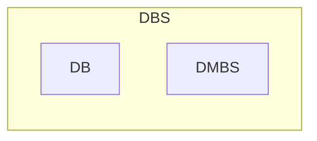
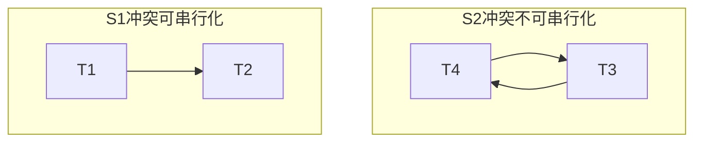
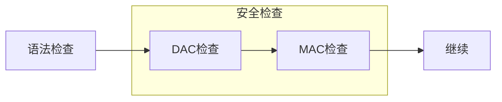

- DBS 数据库系统
- DB 数据库
- DBMS 数据库管理系统



## 数据模型

### 三要素

- 数据结构
- 数据操作
- 数据完整性（约束条件）

### 三种模型

- 层次型
- 网状型
- 关系型

### 三层模型

- 概念模型：E-R图
- 逻辑模型：$R(A,B,C)$
- 物理模型：主键、外键、索引等

### 三级模式

- 外模式（用户模式）：视图、可以有多个
- 模式（逻辑模式）：表结构
- 内模式（存储模式）：数据结构

### 两级独立性

- 逻辑独立：外模式与模式独立
- 物理独立：模式与内模式独立

### 四种语言

- DDL 数据定义语言 CREATE DROP ALTER
- DML 数据操纵语言 INSERT UPDATE DELETE
- DCL 数据控制语言 GRANT REVOKE
- TCL 事务控制语言 COMMIT ROLLBACK CHECKPOINT

## 关系代数

### Key

键，码（Key）：唯一区分不同元组的属性或属性组合。

一个关系可以有多个候选键（Candidate Key），选定其中一个作为主键（Primary Key）。

候选键的属性称为主属性。

### 除法


## 数据库设计

### 新奥尔良设计法

- 需求分析
- 概念设计
- 逻辑设计
- 物理设计

### E-R 图

- 方形：实体
- 圆形：属性
- 菱形：关系

- 一对一 1:1，与任一端的关系模式合并
- 一对多 1:n，与n端的关系模式合并
- 多对多 m:n，转为单独的一个关系模式

### 物理设计

数据存放位置、系统配置、聚簇、索引、HASH

### 函数依赖

如果 $X\rightarrow Y$，但是不存在 $X' \subset X$ 使得 $X'\rightarrow Y$，成为完全依赖，记作$X\stackrel{f}{\rightarrow} Y$，否则称为部分依赖。

属性或属性集 $K$ 和它所在的关系模式 $R(U)$ 满足 $ K\stackrel{f}{\rightarrow} U$ 则 $K$ 为候选码。

### 模式分解

设 ${R_1(U_1), R_2(U_2)}$ 是关系模式 $R$ 的一个分解，则它是无损分解的充分必要条件是：
$$
(U_1\cap U_2)\rightarrow(U_1-U_2) \lor (U_1\cap U_2)\rightarrow(U_2-U_1)
$$

### 规范化

#### 1NF

每个属性不能再分

#### 2NF

1NF，且每个非主属性完全函数依赖于候选码

单码、全码、二元关系一定是 2NF

#### 3NF

1NF，且每个非主属性都不传递依赖于候选码

定理：如果是 3NF，必然是 2NF

#### BCNF

1NF，且每个属性都不传递依赖于候选码

属于BCNF的模式：

- 所有非主属性对每一个码都是完全函数依赖
- 所有的主属性对每一个不包含它的码也是完全函数依赖
- 没有任何属性完全函数依赖于非码的任何一组属性

## SQL

略

## 事务并发

### 事务

事务（transaction）：要么都做要么都不做。特点 ACID：

- 原子性（Atomicity）事务所有操作要么都做要么都不做，由事务管理部件处理
- 一致性（Consistency）事务完成时，数据有一致的状态，由应用开发人员保证
- 隔离性（Isolation）事务并发执行时，不能互相干扰，由并发控制部件处理
- 持续性（Durability）事务一旦提交便是永久的，无论有无故障，由恢复管理部件负责

### 四种并发错误

- 丢失更新
- 读脏数据：读到未提交的数据
- 不可重复读：两次读到的同一行不一致，如某行的字段不同
- 幻读：两次读到的同一表不一致，如某表的行数不同

### 四种隔离级别

- 读未提交
- 读已提交：一个事务要等另一个事务提交后才能再读取数据
- 重复读：一个事务开始读取数据后，不再允许其它事务修改数据
- 序列化：事务串行化顺序执行

### 可串行化调度

可串行化调度：多个事务交叉调度的结果与某一个串行调度的结果相同。

一个调度如果是可串行化的，系统认为其调度是一个正确的调度，保持了数据库的一致性。

#### 简记符号

- WRITE 简写为 W
- READ 简写为 R
- WT(X)：事务 T 写数据库元素 X
- RT(X)：事务 T 读数据库元素 X

S 表示一个调度。如 S = R1(A) R2(A) W1(A) W2(A) R2(B) R1(B) W2(B) W1(B)

#### 冲突可串行化

两个事务，

- 读相同数据的指令、读不同数据的指令不是冲突的。

- 读、写相同数据的指令，即 Ri(A) 和 Wj(A) 指令是冲突的。
- 写相同数据的指令，即 Wi(A) 和 Wj(A) 指令是冲突的。

若调度 S 中属于不同事务的两条操作指令是不冲突的，则可以交换两条指令的执行顺序，得到一个新的调度 S′。称调度 S 与调度 S′ 冲突等价的（conflict equivalent）。若一个调度冲突等价于一个串行调度，则该调度是冲突可串行化的。

冲突可串行是可串行性的充分条件。

冲突可串行化判定：前驱图（precedence graph）

- 前驱图是一个有向图 G
- 顶点代表调度 S 中的事务
- 由 Ti→Tj 的边表示在调度 S 中 Ti 和 Tj 之间存在一对冲突指令，并且 Ti 中的指令先于 Tj 中的指令执行。
- 若前驱图中存在环，则表示调度 S 是不可串行化的。
- 反之，若前驱图中不存在环，表示调度 S 是冲突可串行化的，可用拓扑排序得到调度 S 的一个等价的串行调度。



#### 视图可串行化

对同一事务集，如果两个调度 S1 和 S2 在任何时候都保证每个事务读取相同的值，写入数据库的最终状态也是一样的，则称调度 S1 和 S2 视图等价。

如果某个调度视图等价于一个串行调度，则称这个调度是视图可串行化的。

如果调度是冲突可串行化的，则该调度一定是视图可串行化的。反之未必成立。

### 锁

#### 三种锁

|          | 权限   | 申请               | 升级                                     |
| -------- | ------ | ------------------ | ---------------------------------------- |
| 共享锁 S | 读     | 没有排他锁即可申请 | 需要等待其它共享锁释放后才能升级为排它锁 |
| 更新锁 U | 读     | 没有锁才能申请     | 无须等待其它共享锁释放，直接升级为排它锁 |
| 排它锁 X | 读、写 | 没有锁才能申请     |                                          |

锁申请是有队列的，先来后到。

更新锁的含义是：该资源稍后更新

#### 三级封锁

- 一级封锁：修改数据加X锁直到事务结束才释放
- 二级封锁：在一级封锁的基础上，加了一条：T事务在读取数据R之前必须先对其加上S锁，读完释放S锁
- 三级封锁：一级封锁协议加上事务T在读取数据R之前必须先对其加S锁，直到事务结束才释放

#### 两段锁协议

两段锁协议
- 所有事务分两个阶段提出加锁和解锁申请。
- 增长阶段：在对任何数据进行读、写操作之前，首先申请并获得该数据的封锁。
- 收缩阶段：在释放一个封锁后，事务不再申请和获得其它的任何封锁。
- 两段锁协议是保证冲突可串行化的充分条件，但该协议不保证不发生死锁。

严格两阶段锁
- 除要求满足两段锁协议规定外，还要求事务的排它锁必须在事务提交之后释放。
- 解决级联回滚问题。

强两阶段锁

- 除要求满足两段锁协议规定外，还要求事务的所有锁都必须在事务提交之后释放。

## 故障恢复

### 日志

日志记录形式

- `<T START>`：事务T开始
- `<T COMMIT>`：事务T提交
- `<T ABORT>`：事务T不能成功完成，已中止
- `<T,X,V1,V2>`：事务T对数据项X执行写操作，写之前的旧值为V1，写之后的新值为V2

事务执行写操作，必须在数据库修改前记录此次操作的日志

- 在T开始执行前，向日志中写入记录`<T START>`
- T的一次write(X)操作导致向日志中写入一条新记录
- 最后，当T全部操作结束，向日志中写入记录`<T COMMIT>`

#### 后像后写

- 从后向前扫描日志，将已提交的事务放入redo-list队列
- 从前向后扫描日志，每遇到一个`<T,X,V2>`记录（只需要存新值）
  - 如果T不在redo-list中，则什么也不做
  - 如果T在redo-list中的事务，则为数据项X写入新值V2

#### 后像前写

- 从后向前扫描日志，将已提交的事务放入redo-list队列
- 从前向后扫描日志，每遇到一个`<T,X,V1>`记录（只需要存旧值）
  - 如果T在redo-list中，则什么也不做
  - 如果T不在redo-list中的事务，则为数据项X写入旧值V1

#### 后像前后写

- 首先对日志文件从后向前进行扫描，将有`<T COMMIT>`记录和没有`<T COMMIT>`记录的事务分别放入两个队列：redo-list队列，undo-list队列
- 从前向后再次扫描日志记录，重新执行redo-list队列中的事务
- 从后向前再次扫描日志记录，撤销undo-list队列中的事务

无论是哪一种方案，对每个未完成的事务，需要在日志中写入一个`<T ABORT>`记录并刷新日志。

### 检查点

#### 提交一致性检查点

- 新的事务不能开始直到检查点完成
- 现有的事务继续执行直到提交或中止，并且相关数据都写入稳定存储器
- 将当前日志缓冲区中的日志记录写回稳定存储器中的日志文件
- 将日志记录`<checkpoint>`写入稳定存储器

#### 高速缓存一致性检查点

- 新的事务不能开始直到检查点完成
- 已存在的事务不允许执行新的更新操作，如写缓冲块或写日志记录
- 将当前日志缓冲区中的日志记录写回稳定存储器中的日志文件
- 将当前数据缓冲区中的所有数据记录写入磁盘
- 将日志记录`<checkpoint，L>`写入稳定存储器，其中L是所有活动事务的列表

### 数据转储

#### 静态/动态

- 静态转储：在系统中无运行事务时进行转储，转储期间不允许对数据库的任何存取、修改活动
- 动态转储：转储操作与用户事务并发进行，转储期间允许对数据库进行存取或修改

#### 完全/增量

- 完全转储：每次转储全部数据库
- 增量转储：只转储上次转储后更新过的数据

### 故障恢复

- 事务故障：利用日志故障恢复，详见上文。
- 系统故障：利用日志故障恢复，详见上文。
- 介质故障：
  -  装入最近的完全转储后备副本
  - 如果有后续的增量转储，按照从前往后的顺序，根据增量转储来修改数据库
  - 装入转储结束后的日志文件副本，重做已完成的事务
    - 首先反向扫描日志文件，找出故障发生时已经提交的事务，将事务标识符写入redo-list
    - 然后正向扫描日志文件，对redo-list中的所有事务进行redo操作


## 数据库安全

### 自主访问控制（DAC）

```sql
-- 授予权限
GRANT [权限] 
ON [表或视图]
TO [用户] 
[WITH GRANT OPTION]
-- 收回权限
REVOKE [GRANT OPTION FOR] [权限]
ON [表或视图]
FROM [用户]
[RESTRICT|CASCADE]
-- 基于角色授权（RBAC）
CREATE ROLE Admin
GRANT Admin TO [用户]
GRANT SELECT ON Table TO Admin
```

### 强制访问控制（MAC）

- 对所有主体（系统中的活动实体，如用户）及其所控制的客体（如进程、文件、基表、视图等）实施强制访问控制
- 每一个数据对象被标以一定的密级，每一个用户也被授予某一个级别的许可证，对于任意一个对象，只有具有合法许可证的用户才可以存取

#### 敏感度标记（Label）

- 对于主体和客体，DBMS为它们每个实例（值）指派一个敏感度标记
- 敏感度标记级别：绝密，机密， 可信，公开
- 主体的敏感度标记称为许可证级别，客体的敏感度标记称为密级
- MAC机制就是通过对比主体的Label和客体的Label，最终确定主体是否能够存取客体

#### 强制存取控制规则

- 仅当主体的许可证级别大于或等于客体的密级时，该主体才能读取相应的客体
- 仅当主体的许可证级别小于或等于客体的密级时，该主体才能写相应的客体



### 审计

- 启用一个专用的审计日志（Audit Log）， 将用户对数据库的所有操作记录在上面
- DBA可以利用审计日志中的追踪信息，找出非法存取数据的人
