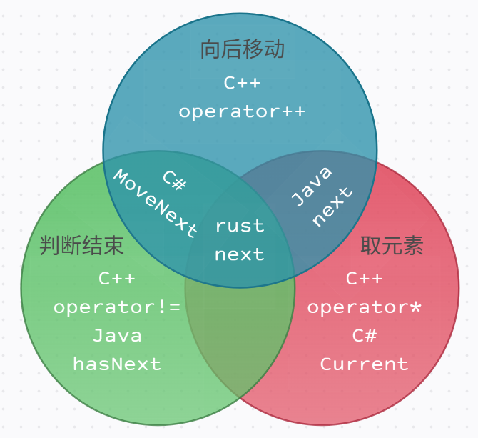

# 迭代器的接口对比

<!--truncate-->

迭代器的接口需要包含三种基本操作：
- 判断是否还有元素
- 获取当前元素
- 移动到下一个元素

如图所示，迭代器的接口设计主要有下面几个流派：



### C++ 的设计

C++ 将这三种操作分别封装成三个函数，分别是 `operator!=`、`operator*` 和 `operator++`。
```cpp
for (auto it = v.begin(); it != v.end(); ++it) {
    std::cout << *it << std::endl;
}
```

这一设计最大的好处就是兼容了 C 语言的指针语义，使得指向数组的指针可以直接像迭代器一样使用。同时由于迭代器的三种操作是分开的，操作起来可以更加灵活。

但是问题也很明显，那就是迭代器本身不是自包含的，需要额外提供一个 `end()` 函数返回的迭代器作为终止条件。在遍历数组或链表时，这个迭代器尚且可以表示 past-the-last 元素，但是对于其他数据结构，这个迭代器可能就没有实际意义了。

C++20 引入了一种称为哨兵迭代器的设计。采用这种设计的迭代器不再需要专门准备一个终止迭代器，而是使用通用的无状态的哨兵迭代器。在与哨兵迭代器比较时，这类迭代器直接通过本身的状态来判断是否还有元素，使得迭代器实现了自包含。

### Java 的设计

Java 将这三种操作封装成两个函数，分别是 `hasNext` 和 `next`。`next` 在返回当前元素的同时，还会移动到下一个元素。当然还有一种理解，认为 Java 的迭代器指向两个元素之间的空隙，`next` 的时候移动到下一个空隙的同时返回越过的元素。
```java
Iterator<Integer> it = v.iterator();
while (it.hasNext()) {
    System.out.println(it.next());
}
```


Java 的设计需要迭代器有预测性，即我们希望在实际调用 `next` 之前就能通过 `hasNext` 知道是否还有元素。对于基于容器的迭代器来说，这可能比较容易实现。但是对于其他场景（如生成器协程），这种设计就不太适用了。因此在一些 Java 的迭代器实现中，`hasNext` 就已经计算出了下一个元素并缓存在了迭代器内部，`next` 直接返回这个缓存的元素。这会导致看似开销较小的 `hasNext` 操作实际上是一个隐含的 `next` 操作，而 `next` 操作并没有执行真正的计算。同时还需要注意，这里的 `hasNext` 应该被设计为幂等的操作，即多次调用 `hasNext` 应该返回相同的结果，且不影响 `next` 的结果。

### C# 的设计

C# 将这三种操作封装成两个函数，分别是 `MoveNext` 和 `Current`。`MoveNext` 在判断是否还有元素的同时，还会移动到下一个元素。
```cs
IEnumerator<int> it = v.GetEnumerator();
while (it.MoveNext()) {
    Console.WriteLine(it.Current);
}
```

与 Java 相比，C# 的设计是反其道而行之。幂等的操作变成了 `Current`，这导致所有的计算都应该发生在 `MoveNext` 之中，`Current` 只应该是一个访问操作。可以是访问容器，也可以是访问迭代器中的缓存。当然，如果你执意要在 `Current` 计算，也不是不可以。

### Rust 和 JavaScript 的设计

Rust 将这三种操作封装成一个函数，即 `next`。`next` 在返回当前元素的同时，还会移动到下一个元素。根据返回的 `Option` 类型来判断是否还有元素，有则返回 `Some`，无则返回 `None`。

```rust
let mut it = v.iter();
while let Some(x) = it.next() {
    println!("{}", x);
}
```

JavaScript 的迭代器设计与 Rust 类似，也是将这三种操作封装成一个函数，即 `next`。`next` 在返回当前元素的同时，还会移动到下一个元素。根据返回的 `done` 字段来判断是否还有元素。

```javascript
let it = v[Symbol.iterator]();
let next = it.next();
while (!next.done) {
    console.log(next.value);
    next = it.next();
}
```


这两个语言直接合并了三个操作，彻底抛弃了在迭代器中可能存在的缓存。返回的类型被套上了一层壳，应该先判断存在与否，再进行使用。


### Python 的设计

Python `__next__` 在返回当前元素的同时，还会移动到下一个元素。当元素遍历完毕时，会抛出 `StopIteration` 异常。

```python
it = iter(v)
while True:
    try:
        print(next(it))
    except StopIteration:
        break
```

这种方式虽然比较低效，但实际上也一点都不快。