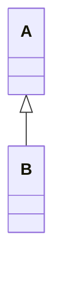
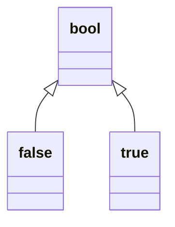
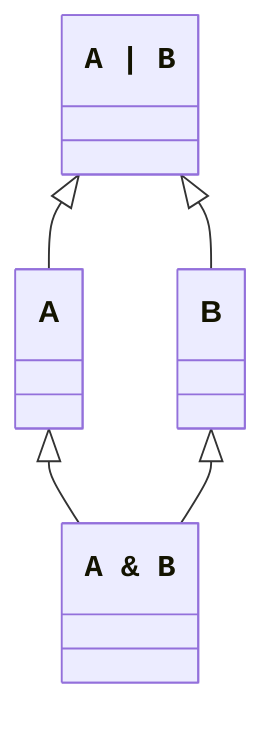
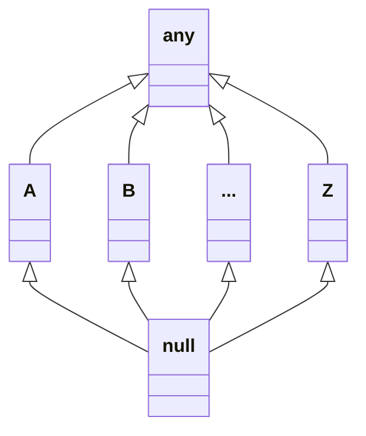
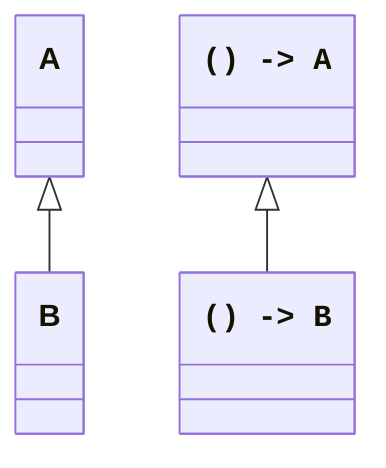
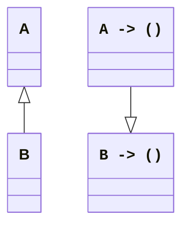
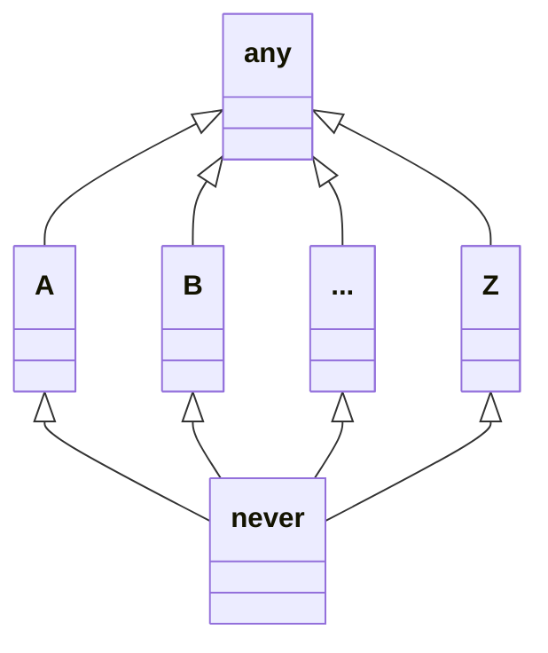
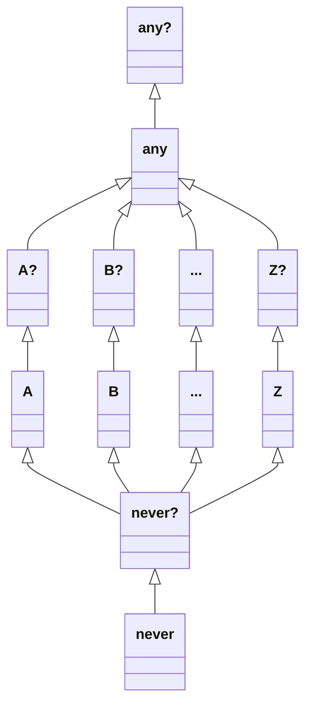

# never say never? ——简介现代类型系统

> 注意：本文之探讨现代类型系统中的一些实践，供大家参考。多有不严谨之处，望学术大佬海涵。

## 类型与类型系统

我们先介绍一下什么是类型。

这里我们简单的把类型（type）定义为值（value）的集合。

例如有两个取值的布尔类型：

```
bool := {false, true}
```

一些类型的取值范围是有限的（例如大部分的基本类型），一些是无限的（如字符串）

### 字面类型

在不引起混淆的情况下，值本身也可以作为一种类型的记号，只包含这个值本身，即

```
false := {false}
true := {true}
```

这样的类型成为字面类型（Literal Type）。

### 联合类型

接着我们引入联合类型（Union Type）或和类型（Sum Type）的概念：

`A` 和 `B` 的联合类型记作 `A | B`，该类型的值可以取 `A` 的值，也可以取 `B` 的值，即在 $A\cup B$ 中取值。

那么我们可以把布尔类型定义为：

```
bool := false | true
```

例如在 Python 中

```python
from typing import Literal

Mode = Literal['r', 'rb', 'w', 'wb']
TrueType = Literal[True]
def open(file: str, mode: Mode) -> TrueType:
    return True
```

参数 mode 取某几个固定的字面量取值，而返回值一定是 `True`，这都可以用字面类型很好的表示。用上面的写法，即

```
Mode := 'r' | 'rb' | 'w' | 'wb'
```

### 交类型

既然有 Union Type 就有 Intersect Type。

`A` 和 `B` 的交类型（Intersect Type）记作 `A & B`，该类型的值必须在 $A\cap B$ 中取。例如

```
ReadMode := 'r' | 'rb'
BinaryMode := 'rb' | 'wb'
```

那么这两个类型的交类型就是 `'rb'`。

### 积类型

既然有 Sum Type 就有 Product Type。所谓 Product，指的就是笛卡尔积。

`A` 和 `B` 的交类型（Product Type）记作 `A x B`，该类型的值必须在 $A\times B$ 中取。例如

```
A = 1 | 2
B = a | b | c
```

那么

```
A x B = (1, a) | (1, b) | (1, c) | (2, a) | (2, b) | (2, c) 
```

可以看出，这其实就是元组（Tuple），因此积类型也可以记作 `(A, B)`

二元组还可以被扩展为 n 元组，这里不再赘述。

一元组的取值与原类型相同，故 `(A) = A`。

零元组非常特殊，只有 `()` 一个取值，被称为单位类型 `Unit`。

## 子类型

如果 $ B \subset A $，则称 `B` 是 `A` 的子类型（Subtyping）。

子类型是一个偏序关系。即满足下面三个性质：

- 自反性：$A \subset A$
- 反对称性：$A\subset B \land B \subset A \implies A = B$
- 传递性：$A\subset B \land B\subset C \implies A\subset C$

从数学本质上来说，子类型似乎只是子集在类型系统里的新名字。但由于面向对象编程（OOP）的发扬光大，子类型已经成为了非常重要的一个概念。

### 面向对象

若一个类型继承自另外一个类型，类图如下所示



根据 OOP 的规则，所有 B 的对象都是一个（is-a）A 的对象。即 $\forall b \in B, b \in A$，也就是说 $ B \subset A $。因此我们可以说 `B` 是 `A` 的子类型。

一般来说，子类型的对象可以隐式转换为父类型，毕竟子类型的取值范围更小，这样的转换天经地义。这个概念可以推广到一般的类型系统中，如我们上面提到的 `bool` 类型，类图如下所示



因此，当一个类的所有子类确定，且本身不会有额外的对象（在面向对象里，就是一个抽象类或是接口），那么它的派生关系实际上可以写作所有子类型的联合类型。

显然，根据定义，任意两个类型 `A` `B` 都有公共父类型 `A | B`，同时有公共子类型 `A & B`，类图如下所示



`A & B` 常用于表示同时实现两个接口类型。根据定义，它能作为其中任意一个类型的对象被使用。

如果我们要尝试把所有类型的图画出来，你可能会本能的追问两个问题：这个图的顶端是谁？这个图的底端是谁？

其实很多 OOP 语言都实现成了“单根模型”，即所有的类都有一个共同的父类。如 `java.lang.Object` `kotlin.Any` `System.Object` 等等。基于这样的模型，类图的顶端自然就是这个单根。在之后的叙述中，我们把这个类型记作 `any`，表示所有类型的联合、所有类型的父类型。

### `null`

现在我们来探究一个问题，空指针 `null` 是什么类型？

你可能会下意识的认为，既然所有类型都可以赋值为 `null`，那它理所应当是 `any` 类型的。这忽略了一个事实：只有子类型才可以直接转换为父类型。`any` 不是除了本身之外任何类型的父类型，所以 `null` 若是 `any` 则几乎不能赋值给任何类型。这显然是矛盾的。

稍加思索你会注意到，由于 `null` 可以赋值给任何类型，所以它实际上是任何类型的子类。即




实际上，还有一种非常容易思考的方法得出这个结论：既然 `null` 可以赋值给任何类型，那么所有类型的交集，自然而然有且仅有这一个 `null` 的取值。

“一切类型的子类型”，这一点可能相当的反直觉，但却符合逻辑与实践。许多带 `null` 语言的类型系统就是这样实现的。

根据类图，我们可以把把 `any` 称为 Top Type，`null` 称为 Bottom Type。用 `null` 作为 Bottom Type 并非是唯一的选择，我们在后面还会提到别的考虑。

## 函数类型

我们先来考虑一种特殊的类型——函数类型。

所谓函数类型，即用于描述接受某些参数 `A`，返回某些返回值 `B` 的类型，记作 `A -> B`。

这里只有一个参数，有多个参数的情况，可以用各个参数类型的笛卡尔积来表示。同理，多个返回值的情况也可以轻松表示。即 `(A1, A2, ..., An) -> (B1, B2, ..., Bn)`。

那么 `void` 怎么办？考虑到它什么也没有接受/返回，可以用 `()` 即 `Unit` 来表示。这个方案把多个参数和返回值用元组表示的规律相统一，成为了很多现代编程语言的实践。

### 函数型变

下面我们来讨论函数类型之间的类型关系，尤其是其形变（variance）。假设 `B` 是 `A` 的子类型。

#### 协变

考虑下面两个函数及其类型

```
f: () -> A
g: () -> B
```

由于 `B` 是 `A` 的子类型，所以 `g()` 的结果是 `B` 也是 `A`。那么我们就能说，`g` 的类型同时也可以是 `() -> A`。既然所有 `() -> B` 都是 `() -> A`，那么前者就是后者的子类型，即




这样函数派生关系与类型派生关系方向相同的型变成为协变（covariance）

#### 逆变


考虑下面两个函数和两个对象，及其类型

```
f: A -> ()
g: B -> ()
a: A
b: B
```

由于 `B` 是 `A` 的子类型，所以不仅 `f(a)` 调用是合法的，而且 `f(b)` 调用也是合法的。那么我们就能说，`f` 的类型同时也可以是 `B -> ()`。既然所有 `A -> ()` 都是 `B -> ()`，那么前者就是后者的子类型，即




这样函数派生关系与类型派生关系方向相反的型变成为逆变（contravariance）

#### 不变

考虑下面两个函数及其类型

```
f: A -> A
g: B -> B
```

显然对于参数而言，可以构成逆变，对于返回值而言，可以构成协变。但是合在一起，派生关系的方向就相互矛盾了。因此这样的函数类型称为不变（invariance）。而

```
f: A -> B
g: B -> A
```

则不同，虽然同时构成协变和逆变，但是两者的派生关系是相互平行的。故最终可以得出 `A -> B` 是 `B -> A` 的子类型。

## `never`

### 永不返回

当我们说，一个函数不返回任何东西，和一个函数不返回的时候，实际上含义是不一样的。前者会返回，只是没有返回值，后者则是不会回到调用函数的地方。一个典型的例子便是 C/C++ 的 `exit` 函数，声明如下所示：

```cpp
[[noreturn]] void exit(int status);
```

在这里，`[[noreturn]]` 用来标注函数永远不会返回。你可能已经发觉，`[[noreturn]] void` 这两个在一起似乎有些多余。难道不会返回的函数还能声明为非 `void` 的情况吗？许多现代语言引入了 `never` 类型（一些语言称为 `nothing`），专门用于表示这种不会返回的函数类型。例如上面的函数就可以表示为

```
exit: int -> never
```

如果我们想要认为构造出一个返回 `never` 的函数，最简单的方法莫过于

- 调用其它返回 `never` 的函数
- 死循环
- 抛出异常

抛出异常看似会返回到上一层栈帧，但实际上不会返回到函数的调用点，故同样是永不返回。

### 分支语句

考虑下面的语句：

```
a: A
b: B
value = cond ? a : b;
```

`value` 是什么类型？为了保证可以接受两个分支的值，显然应该是 `A | B`。

假如把代码改为

```
value = cond ? a : throw Exception();
```

显然两个分支的类型分别是 `A` 和 `never`。由于第二个分支不可能返回，所以 `value` 的类型必然取一个分支的类型 `A`。根据前面的公式，即 `A | never = A`。这个恒等式实际上就说明 $\text{never} \subset A$。

稍加思索你会发现，对于任何类型，这个结果都满足。换句话，任何类型都是 `never` 的父类型。这也与实践相吻合：既然不会返回，那么实际上可以 `never` 当做任意类型的值来看待。这或许也说明，前面的 ``[[noreturn]] void`` 并列，并非是完全多余的。如果你希望它参与运算，或许换成其它类型也是合理的。

由于 `never` 实际上不可能有任何的取值，我们可以得出 $\text{never} = \varnothing$，这也符合上面的数学逻辑。

很显然，我们得出了一种新的 Bottom Type 的方案，那就是 `never`。



现在还有个小问题没有解决：如果一个类型系统里面同时有 `never` 和 `null`，怎么会出现两个 Bottom Type 呢？难道它们两个都是所有类型的子类型？

## `never?`

### 空语义

要先回答这个问题，我们不妨来看看 `null` 究竟是什么意思。

`null` 最初用来表示空指针，引申为，一个不存在的对象。由于人们常常忘记检查它的存在，所以带来的问题比较多。现代的编程语言有两个实际上等价的解决方案：`Option<T>` 和 Nullability。

一种方法，`Option<T> = T | ()`，即要么有值，要么是 `()`。这样在使用的时候就必须先排除是 `()` 的情形。

另一种方法称为 Nullability，即默认普通的类型 `T` 不能包含 `null`，只有显式添加一个问号 `T?` 的时候，才可以是接受 `null`。显然 `T? = T | null`，是 `T` 的父类型，不能直接转换为 `T`，进而就需要额外的检查才能使用。

前一种方案往往用于没有 `null` 的情况。而我们如果要讨论 `never` 与 `null` 并存，故讨论后一种方案更为合理。

### 结论

讲到这里其实答案已经呼之欲出，根据 `T? = T | null`：

令 $T = \varnothing = \text{never}$，那么 $\text{never}? = \varnothing | \text{null} = \text{null}$。

也就是说，`never? = null`。

根据定义，`T` 是 `T?` 的子类型，所以最终我们得出了结论：`never` 才是真正的 Bottom Type。

我们也可以画出一个完整的，带 Nullability 的类图：



推荐 BGM：[Never Enough](https://www.bilibili.com/video/BV1sP411p7Hm/)
