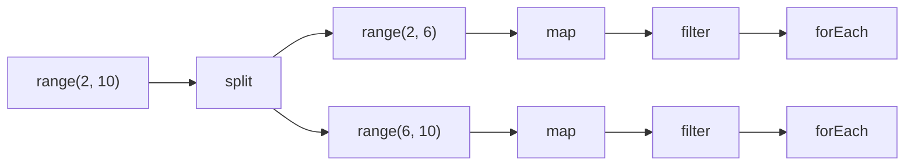
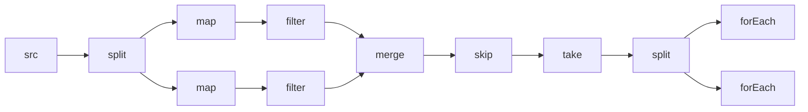

# 曲水流觞：上援下推

:::note
这篇博客的代码用 JavaScript 编写，力图省去一些不必要的语法细节。大部分现代语言都能复现这些代码，所以编程语言的选择不是最重要的。
:::

## 循环

处理一组数据时，我们通常会用循环。循环的自由度很高，可以处理各种各样的情况。但是这样带来的问题是，循环的代码通常会变得很复杂，难以理解、维护和复用。这里我们用一个非常简单的例子说明这个问题。

```javascript
// find the first 3 even squares, but skip the first one
let skip = 1
let take = 3
for (let i = 0; i < 10; i++) {
    let sq = i * i;
    if (sq % 2 == 0) {
        if (skip-- <= 0) {
            if (take-- > 0) {
                console.log(sq); // prints 4, 16, 36
            } else {
                break;
            }
        }
    }
}
```

我们能不能把这个循环的逻辑分解成几个独立的部分，然后组合起来呢？

## 批处理

一个常见的想法是，将每一步的处理结果保存下来，然后传递给下一步。这里我们给出一个上面例子的批处理版本。

```javascript
function iota(n) {
    let result = []
    for (let i = 0; i < n; i++) {
        result.push(i);
    }
    return result;
}

function map(mapper, array) {
    let result = [];
    for (const item of array) {
        result.push(mapper(item));
    }
    return result;
}

function filter(predicate, array) {
    let result = [];
    for (const item of array) {
        if (predicate(item)) {
            result.push(item);
        }
    }
    return result;
}

function take(n, array) {
    let result = [];
    for (const item of array) {
        if (n-- > 0) {
            result.push(item);
        } else {
            break;
        }
    }
    return result;
}

function skip(n, array) {
    let result = [];
    for (const item of array) {
        if (n-- <= 0) {
            result.push(item);
        }
    }
    return result;
}

function forEach(fn, array) {
    for (const item of array) {
        fn(item);
    }
}

forEach(console.log, take(3, skip(1, filter(x => x % 2 == 0, map(x => x * x, iota(10))))));
```

:::info
这一套函数在 JavaScript 的数组上已经有了现成的部分实现（`map`、`filter`、`forEach`），`slice` 和 `skip`、`take` 功能类似但是原理不同。这里写出来是为了更好的说明问题。
:::

这个版本的代码更加清晰，每个函数只做一件事情。但是这个版本的代码有两个问题：

- 每个函数都会生成一个新的数组，但是我们只需要最终的结果。这样会导致空间的浪费。
- 每个函数都会遍历整个数组，但是我们最终只需要三个元素。这样会导致时间的浪费。

作为一个例子，我们请求的数据还很廉价，流程还很简单。但是在真实场景中，如果数据请求成本高昂，流程更加复杂，这两种浪费将不可忽略。我们能不能做的更好呢？

## 流水线（上）

批处理的做法是一次处理所有元素的一个步骤，完成之后再进入下一个步骤。如果我们能够一次处理一个元素，一次性就把这个元素的所有步骤跑通，那么我们就可以避免上面的两个问题。这就是流水线的思想。

### 迭代器

批处理中用到的 `for...of` 就是针对迭代器的一个特性，只不过是一次性遍历所有元素。现在我们要手动操作迭代器实现一个流水线。

为了让不了解 JavaScript 的读者能够理解，我们先给出一个简单的迭代器的例子作为解释。

```javascript
function iota(n) {
    let i = 0;
    return {
        next() {
            if (i < n) {
                return { value: i++, done: false };
            } else {
                return { done: true };
            }
        }
    };
}
```

这个函数返回一个迭代器，这个迭代器可以生成 0 到 n-1 的整数。
    
```javascript
let it = iota(10);
let result = it.next();
while (!result.done) {
    console.log(result.value);
    result = it.next();
}
```

这个例子中，我们手动调用了迭代器的 `next` 方法，直到 `done` 为 `true`。

为了方便起见，我们接下来使用这样一套工具：

```javascript
function iterate(next) {
    return {
        [Symbol.iterator]() {
            return this;
        },
        next
    };
}

function more(value) {
    return { done: false, value };
}

function done() {
    return { done: true };
}
```

第一个函数可以让迭代器本身也是可迭代的对象，这样我们可以直接使用 `for...of` 语法。后两个函数可以让我们更方便的生成迭代器的返回值。

于是我们可以把批处理的代码重写如下：

```javascript
function iota(n) {
    let i = 0;
    return iterate(() => i < n ? more(i++) : done());
}

function map(mapper, upstream) {
    return iterate(() => {
        let next = upstream.next();
        return next.done ? done() : more(mapper(next.value));
    });
}

function filter(predicate, upstream) {
    return iterate(() => {
        let next = upstream.next();
        while (!next.done && !predicate(next.value)) {
            next = upstream.next();
        }
        return next;
    });
}

function take(n, upstream) {
    return iterate(() => n-- > 0 ? upstream.next() : done());
}

function skip(n, upstream) {
    return iterate(() => {
        while (n-- > 0) {
            if (upstream.next().done) {
                return done();
            }
        }
        return upstream.next();
    });
}

function forEach(fn, upstream) {
    for (const item of upstream) {
        fn(item);
    }
}

function toArray(upstream) {
    const result = [];
    forEach(item => result.push(item), upstream);
    return result;
    // or you can use spread operator
    // return [...upstream];
}

forEach(console.log, take(3, skip(1, filter(x => x % 2 == 0, map(x => x * x, iota(10))))));
```

`upstream` 是上游迭代器，通过构造一个迭代器链，最下游的迭代器被调用一次，会按需调用上游迭代器，直到最上游的迭代器。最上游的迭代器会生成数据，然后数据会一级一级的传递到最下游的迭代器。


迭代器的理念虽好，但是编写迭代器的代码还是有点费脑子。例如 `map` 和 `take` 的 `next` 只需要调用至多一次上游迭代器，而 `filter` 和 `skip` 需要在 `next` 方法中循环调用上游迭代器。这是因为无论上游迭代器提供的数据是否符合条件，都需要为下游迭代器提供数据。同时，维护迭代器的状态也是一个问题。下面我们引入一个新的函数 `flatMap` 来研究一下。

### 扁平化（上）

有的时候我们需要把一个元素映射成多个元素，然后再处理。例如

```javascript
let result = []
for (let i = 0; i < 3; i++) {
    for (let j = 0; j <= i; j++) {
        result.push(j);
    }
}
console.log(result); // prints [0, 0, 1, 0, 1, 2]
```

如果这里用 `map` 和 `iota` 函数，我们会得到一个数组的数组，而不是一个扁平的数组。这就需要 `flatMap`，它可以把一个元素映射成一个迭代器，然后把这个迭代器的所有元素串联起来。我们先给出它的批处理版本。

```javascript
function flatMap(mapper, array) {
    let result = [];
    for (const item of array) {
        for (const subitem of mapper(item)) {
            result.push(subitem);
        }
        // or you can use spread operator:
        // result.push(...mapper(item));
    }
    return result;
}

console.log(flatMap(x => iota(x + 1), iota(3))); // prints [0, 0, 1, 0, 1, 2]
```

但如果我们要实现一个迭代器版本的 `flatMap`，我们会发现这个函数的实现变得非常复杂。

```javascript
function flatMap(mapper, upstream) {
    let iterator = null;
    return iterate(() => {
        while (true) {
            if (iterator === null) {
                let next = upstream.next();
                if (next.done) {
                    return done();
                }
                iterator = mapper(next.value);
            }
            let next = iterator.next();
            if (next.done) {
                iterator = null;
                continue;
            }
            return next;
        }
    });
}

console.log(toArray(flatMap(x => iota(x + 1), iota(3)))); // prints [0, 0, 1, 0, 1, 2]
```

### 生成器

为了解决手工编写迭代器代码的难题，我们可以使用生成器协程来简化这个过程。

`function*` 表明这个函数是一个生成器协程，调用这个函数会返回一个迭代器。函数中的 `yield` 关键字可以让一个函数在执行过程中暂停，然后再次调用时从暂停的地方继续执行，函数的执行过程就像一个迭代器一样。这样迭代器的状态就可以保存在函数的局部变量中，而不需要手动维护。

```javascript
function* iota(n) {
    for (let i = 0; i < n; i++) {
        yield i;
    }
}

function* map(mapper, upstream) {
    for (const item of upstream) {
        yield mapper(item);
    }
}

function* filter(predicate, upstream) {
    for (const item of upstream) {
        if (predicate(item)) {
            yield item;
        }
    }
}

function* take(n, upstream) {
    for (const item of upstream) {
        if (n-- <= 0) {
            break;
        }
        yield item;
    }
}

function* skip(n, upstream) {
    for (const item of upstream) {
        if (n-- > 0) {
            continue;
        }
        yield item;
    }
}

// forEach and toArray are the same as before since they are terminal operations

forEach(console.log, take(3, skip(1, filter(x => x % 2 == 0, map(x => x * x, iota(10))))));
```

不妨再来看看这个版本的 `flatMap`。

```javascript
function* flatMap(mapper, upstream) {
    for (const item of upstream) {
        for (const subitem of mapper(item)) {
            yield subitem;
        }
        // or you can use yield* to delegate to another generator
        // yield* mapper(item);
    }
}

console.log(toArray(flatMap(x => iota(x + 1), iota(3))));
```

`yield*` 关键字可以让一个生成器协程委托给另一个生成器协程。生成器内部实际上维护了一个栈，每次调用 `next` 方法时，会从栈顶取出一个生成器协程执行。生成器耗尽，弹出栈顶的生成器协程，继续执行上一个生成器协程。这样的机制进一步省去了嵌套带来的麻烦。

生成器协程是一种非常强大的工具，可以让我们用一种非常直观的方式来处理迭代器。

### 链式调用（上）

不过套娃的方式还是有点繁琐，我们可以使用链式调用的方式来简化代码。不同的语言对这块的处理方式不尽相同，这里我们给出一个简单的实现。

```javascript
function chain(upstream) {
    return Object.assign(upstream, {
        map: mapper => chain(map(mapper, upstream)),
        filter: predicate => chain(filter(predicate, upstream)),
        take: n => chain(take(n, upstream)),
        skip: n => chain(skip(n, upstream)),
        flatMap: mapper => chain(flatMap(mapper, upstream)),
        forEach: fn => {
            forEach(fn, upstream);
            return upstream;
        },
        toArray: () => toArray(upstream)
    });
}

function decorate(source) {
    return (...args) => chain(source(...args));
}

iota = decorate(iota);

iota(10)
    .map(x => x * x)
    .filter(x => x % 2 == 0)
    .skip(1)
    .take(3)
    .forEach(console.log);

console.log(iota(3)
    .flatMap(x => iota(x + 1))
    .toArray());
```

## 流水线（下）

流水线除了带来延时求值的好处，还有一个好处是可以并行处理。但是上面基于迭代器似乎不太容易实现并行处理。归根结底，这是因为
- 一个迭代器的数据只能传递给下一个迭代器，而不能传递给多个迭代器。
- 经过层层套娃，数据的源头被隐藏了，无法有效的分割来实现并行处理。

那我们能不能设计一个更加灵活的流水线呢？这需要一些逆向思维——能否不再是下游迭代器主动调用上游迭代器，而是上游迭代器主动把数据传递给下游迭代器呢？

### 回调

现在我们完全把上下游关系倒置，重新编写如下的流水线。

```javascript
function iota(n, downstream) {
    for (let i = 0; i < n; i++) {
        downstream(i);
    }
}

function map(mapper, downstream) {
    return item => {
        downstream(mapper(item));
    };
}

function filter(predicate, downstream) {
    return item => {
        if (predicate(item)) {
            downstream(item);
        }
    };
}

function take(n, downstream) {
    return item => {
        if (n-- > 0) {
            downstream(item);
        }
    };
}

function skip(n, downstream) {
    return item => {
        if (n-- <= 0) {
            downstream(item);
        }
    };
}

function forEach(fn) {
    return item => {
        fn(item);
    };
}

function toArray(result) {
    return item => {
        result.push(item);
    };
}

iota(10, map(x => x * x, filter(x => x % 2 == 0, skip(1, take(3, forEach(console.log))))));
let result = [];
iota(10, toArray(result));
console.log(result);
```

请注意最后一行的套娃顺序，已经完全反转了。与刚才的逻辑完全不同，整个流水线是由源头而非终点驱动的。现在每一个环节都只处理一个元素，然后把这个元素传递给下一个环节。这一点从这几个函数的定义就能看出来，非常简单直接。

### 短路

这样驱动的流水线有一个问题：当下游希望结束流水线时，上游并不知道。所以需要手动实现一个短路机制。

```javascript
function iota(n, downstream) {
    for (let i = 0; i < n; i++) {
        if (downstream.cancelled()) {
            return;
        }
        console.log(`iota: ${i}`);
        downstream(i);
    }
}

function delegateCancelleable(downstream, fn) {
    return Object.assign(fn, {
        cancelled: () => downstream.cancelled()
    });
}

function map(mapper, downstream) {
    return delegateCancelleable(downstream, item => {
        downstream(mapper(item));
    });
}

function filter(predicate, downstream) {
    return delegateCancelleable(downstream, item => {
        if (predicate(item)) {
            downstream(item);
        }
    });
}

function take(n, downstream) {
    return Object.assign(item => {
        if (n-- > 0) {
            downstream(item);
        }
    }, {
        cancelled: () => n <= 0 || downstream.cancelled()
    });
}

function skip(n, downstream) {
    return delegateCancelleable(downstream, item => {
        if (n-- <= 0) {
            downstream(item);
        }
    });
}

function forEach(fn) {
    return Object.assign(item => {
        fn(item)
    }, {
        cancelled: () => false
    });
}

iota(10, map(x => x * x, filter(x => x % 2 === 0, skip(1, take(3, forEach(console.log))))));
```

输出：

```
iota: 0
iota: 1
iota: 2
4
iota: 3
iota: 4
16
iota: 5
iota: 6
36
```

这样，我们就可以在任何一个环节中终止流水线。

为了简洁起见，后面的代码中我们省略了这个机制。

### 链式调用（下）(一)

这个形式看上去似乎不太容易嵌套——想要增加一步操作，在外套一层是很符合直觉的，但是往最里面塞一层却需要一些函数式的技巧。我们给出一个简单的链式调用的实现。

```javascript
function chain(source) {
    return Object.assign(source, {
        map: mapper => chain(downstream => source(map(mapper, downstream))),
        filter: predicate => chain(downstream => source(filter(predicate, downstream))),
        take: n => chain(downstream => source(take(n, downstream))),
        skip: n => chain(downstream => source(skip(n, downstream))),
        forEach: fn => source(forEach(fn)),
        toArray: () => {
            let result = [];
            source(toArray(result));
            return result;
        }
    });
}

function decorate(source) {
    return (...args) => chain(downstream => source(...args, downstream));
}

iota = decorate(iota);

iota(10)
    .map(x => x * x)
    .filter(x => x % 2 == 0)
    .skip(1)
    .take(3)
    .forEach(console.log);
```

希望你暂时没被绕晕，因为魔法才刚刚开始，接下来，准备迎接函数式的洗礼吧！

### 科里化

所谓科里化，就是把一个多参数的函数转换成一系列单参数函数的过程。例如：

```javascript
function add(x, y) {
    return x + y;
}
let sum = add(1, 2);
```

可以转换成

```javascript
function add(x) {
    return y => x + y;
}
let sum = add(1)(2);
```

这样的好处是可以更加灵活的组合函数。

在我们的例子中，我们可以把每一个环节都转换成一个单参数函数，然后再组合起来。

```javascript
function iota(n) {
    return downstream => {
        for (let i = 0; i < n; i++) {
            downstream(i);
        }
    };
}

function map(mapper) {
    return downstream => item => {
        downstream(mapper(item));
    };
}

function filter(predicate) {
    return downstream => item => {
        if (predicate(item)) {
            downstream(item);
        }
    };
}

function take(n) {
    return downstream => item => {
        if (n-- > 0) {
            downstream(item);
        }
    };
}

function skip(n) {
    return downstream => item => {
        if (n-- <= 0) {
            downstream(item);
        }
    };
}

// forEach and toArray are the same as before since they are terminal operations

iota(10)(map(x => x * x)(filter(x => x % 2 == 0)(skip(1)(take(3)(forEach(console.log))))));
```

### 扁平化（下）

:::tip
开始之前，可以先阅读一下 [Lambda Calculus](../docs/lambda) 的介绍。
:::

在流水线倒置之后，循环便从中间的过程中消失了，函数变得异常简单，这也为我们窥视他们的本质提供了一个绝佳的机会。

例如，如果自己观察上面 `forEach` 的实现，就会发现它其实等价于原封不动的返回了它的参数。

```javascript
function forEach(fn) {
    return item => {
        fn(item);
    };
    // or you can return fn directly
    // return fn;
}
```

如果你自己观察，就会发现这其实是 lambda calculus 中的 [eta reduction](../docs/lambda/1#eta-reduction)。

$$
\lambda y.xy = x
$$

而 `map` 函数的定义：

```javascript
function map(mapper) {
    return downstream => item => {
        downstream(mapper(item));
    };
}
```

可以写成

```javascript
const map = mapper => downstream => item => downstream(mapper(item));
```

函数参数的名字并不重要（[alpha reduction](../docs/lambda/1#alpha-reduction)），略去名字可得

```javascript
const map = f => g => x => g(f(x));
```

记作 lambda calculus 中的形式：

$$
\text{map}=\lambda f.\lambda g.\lambda x.g(fx)
$$

你会意识到这是一种纯粹的函数组合：把 `f` 和 `g` 组合起来，先调用 `f`，然后用结果再调用 `g`。

现在，请你思考一下： `flatMap` 函数该如何定义？

你会发现，`mapper(item)` 返回的对象，实际上就是可以驱动下游的源头。直接将它用于驱动下游，就可以实现扁平化的效果。

```javascript
function flatMap(mapper) {
    return downstream => item => {
        mapper(item)(downstream);
    };
}

let result = [];
iota(3)(flatMap(x => iota(x + 1))(toArray(result)));
console.log(result);
```

也可以写成

```javascript
const flatMap = mapper => downstream => item => mapper(item)(downstream);
```

略去名字可得

```javascript
const flatMap = f => g => x => f(x)(g);
```

记作 lambda calculus 中的形式：

$$
\text{flatMap}=\lambda f.\lambda g.\lambda x.fxg
$$

在这之前，你可能根本不会相信，`f => g => x => g(f(x))` 和 `f => g => x => f(x)(g)` 竟然有这样的含义。


### 链式调用（下）(二)

我们不妨重新实现一次链式调用，但利用科里化的优势，采取不同的策略——把每一步存起来，到最后再进行组合。这个策略的好处在后面的小节会有所体现。

```javascript
function chain(source) {
    let actions = []
    
    return Object.assign(source, {
        pipe(action) {
            actions.push(action)
            return this
        },
        run(terminal) {
            let dowstream = terminal;
            while (actions.length > 0) {
                dowstream = actions.pop()(dowstream)
            }
            source(dowstream)
        },
        map: mapper => source.pipe(map(mapper)),
        filter: predicate => source.pipe(filter(predicate)),
        take: n => source.pipe(take(n)),
        skip: n => source.pipe(skip(n)),
        forEach: fn => source.run(forEach(fn)),
        toArray: () => {
            let result = [];
            source.run(toArray(result));
            return result;
        }
    });
}

function decorate(source) {
    return (...args) => chain(source(...args));
}

iota = decorate(iota)

iota(10)
    .map(x => x * x)
    .filter(x => x % 2 == 0)
    .skip(1)
    .take(3)
    .forEach(console.log);
```

### 分割与并行

有了以上的内容作为铺垫，我们现在可以很容易的实现并行处理。

:::warning
很遗憾，一般来说 JavaScript 是单线程的，而 Web Worker 太重量级不适用于我们这种情景。所以接下来实现的并行只是一种模拟，大家就当咱只有一个核心的 CPU 就好了。如果你采用的是其他语言，可以很容易的实现真正的并行。
:::

实现并行的核心在于，将数据源分割成两部分，然后分别传递给两个下游。所以我们需要先添加一个 `split` 方法。

```javascript
function half(n) {
    return Math.floor(n / 2);
}

function iota(n) {
    return Object.assign(downstream => {
        for (let i = 0; i < n; i++) {
            downstream(i);
        }
    }, {
        split: () => [range(0, half(n)), range(half(n), n)]
    });
}

function range(start, end) {
    return Object.assign(downstream => iota(end - start)(map(x => x + start)(downstream)), {
        split: () => [range(start, half(start + end)), range(half(start + end), end)]
    });
}
```

然后稍微改造一下我们的链式调用函数。这里不妨让我们假设 `||` 就是我添加的并行操作符。我故意让右边的操作符先执行，这样就可以模拟并行乱序的效果。

```javascript
function chain(source) {
    let actions = []
    let is_parallel = false
    
    return Object.assign(source, {
        parallel() {
            is_parallel = true
            return this
        },
        pipe(action) {
            actions.push(action)
            return this
        },
        run(terminal) {
            let downstream = terminal;
            while (actions.length > 0) {
                downstream = actions.pop()(downstream)
            }
            if (is_parallel) {
                let [left, right] = source.split()
                right(downstream) || left(downstream) // fake parallelism
            } else {
                source(downstream)
            }
        },
        map: mapper => source.pipe(map(mapper)),
        filter: predicate => source.pipe(filter(predicate)),
        forEach: fn => source.run(forEach(fn))
    });
}

function decorate(source) {
    return (...args) => chain(source(...args))
}

iota = decorate(iota)
range = decorate(range)

range(2, 10)
    .map(x => x * x)
    .filter(x => x % 2 == 0)
    .parallel()
    .forEach(console.log) // prints 36, 64, 4, 16
```

对此，我们可以画一张示意图：




### 状态和顺序

你可能注意到我这里只用了 `map` 和 `filter`，`take` 和 `skip` 似乎被省略了。这是因为 

- `map` 和 `filter` 是无状态的，而 `take` 和 `skip` 是有状态的。
- `map` 和 `filter` 是无序的，而 `take` 和 `skip` 是有序的。

所谓有状态，就是指一个函数的输出依赖于之前的输入。例如 `take` 函数，它需要记录已经处理了多少个元素。在并行化的情况下，这种状态是无法共享的。

所谓有序，是指元素之间有顺序关系。例如 `skip` 函数，它跳过的是开头的几个元素。在并行化的情况下，这种顺序是无法保证的。

想要解决这个问题，我们就需要在遇到有状态和有序的函数时，将数据进行汇总，处理完之后然后再分发。大致的思路是这样的：



一般来说，子序列内部是有序的，但是子序列之间是无序的。所以合并的时候可以参考源头的分割的顺序。

不过，如果数据源本身就是无序的（如哈希表），那么 `take` 可以在所有线程取至多任意 `n` 元素后合并再取 `n` 个元素，这样就可以并行处理了。但是对于大多数情况，这样的技巧并不适用。

总的来说，这一部分的处理是比较复杂的，我就不给出代码了，~~留作习题~~。

## 反思：曲水流殇，上下其手

在上面的文章里，我们介绍了流水线一些优点，如延时求值、短路求值、并行求值。流水线优点那么多，我应该处处使用它们吗？

当然不是。流水线同时也带来了很多问题，包括但不限于：

- 流水线的调试比较困难，层层嵌套的函数调用栈会让你很难找到问题所在。
- 流水线的结构会消耗很多内存，有时可能比要处理的数据本身还多，这对 GC 语言来说是不小的负担。
- 流水线之间的操作无法协作，无法进行整体优化。（如将 `sort` 和 `take` 合并为 top-k 算法）
- 流水线库提供的操作有限，强行复用代码丑陋，自己实现则比较麻烦，因此相比循环灵活性受限。
- 流水线破坏了数据的局部性（尤其是对于小数组而言），这可能会导致缓存失效，性能下降。

正所谓，当你的手里只有一把锤子，那么所有的问题都会变成钉子。流水线是一种很好的工具，但是并不是万能的。有时候，我们还是需要回到循环和批处理的怀抱。

## 后记

标题是是两个成语，前者指流水线，后者表示本文的两个篇章——从上游获取元素（上拉）和向下游传递元素（下推）。

流水线在数据库管理系统里面又叫“火山模型”。批处理和流水线的选择在数据库管理系统中也是一个重要的问题。

很多语言的标准库提供对迭代器的操作（如 Python、Rust），这都是上拉流水线的实现。

我有一个 C++ 版本的上拉流水线的简单实现，[可供参考](https://github.com/Yaossg/cppStream)。

本文下推流水线部分的灵感来自于 Scala 和 Java 标准库的 `Stream`。两者用于分割的类分别叫做 `Stepper` 和 `Spliterator`。

同为 JVM 语言的 Kotlin 标准库则同时提供了批处理和流水线两种风格的函数（其中流水线采用的是上拉）。

本文还有一个姊妹篇：[迭代器的接口对比](./iterator)，介绍了不同语言的迭代器接口异同。
