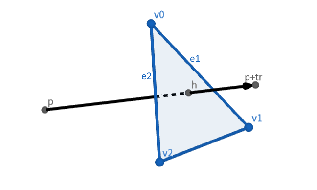

## 背景

在图形学编程中，经常需要求玩家准心对准的物体。该问题可转化为求与玩家视线相交且离玩家最近的三角形面片所对应的物体。因此需要一种光线-三角形相交算法来求出视线是否与某三角形相交、若相交，距离又是多少。下面介绍一种简单的基于参数和矩阵求解的算法。

## 原理

已知三角形的三个顶点 $\pmb v_0,\pmb v_1,\pmb v_2$，可以给出三角形内点的参数方程：
$$
\pmb h=\pmb v_0+\alpha(\pmb v_1- \pmb v_0)+\beta(\pmb v_2- \pmb v_0)
$$

其中参数 $\alpha,\beta$ 满足下面的条件：

$$
\alpha\ge0,\beta\ge0,\alpha+\beta\le1
$$

令

$$
\pmb e_1=\pmb v_1-\pmb v_0\\
\pmb e_2=\pmb v_2-\pmb v_0\\
$$

则可简记为：

$$
\pmb h=\pmb v_0+\alpha\pmb e_1+\beta\pmb e_2
$$

玩家从 $\pmb p$ 点往 $\pmb r$ 方向看去，与三角形所在平面的交点为 $\pmb h$ 的参数方程：

$$
\pmb h=\pmb p+t\pmb r
$$

其中参数 $t$ 满足：

$$
t\ge0
$$

如图所示：



联立两个方程
$$
\pmb v_0+\alpha\pmb e_1+\beta\pmb e_2=\pmb p+t\pmb r
$$
移项
$$
\alpha\pmb e_1+\beta\pmb e_2-t\pmb r=\pmb p-\pmb v_0
$$
即
$$
(\pmb e_1,\pmb e_2,-\pmb r)
\left(\begin{array}{r}
\alpha\\
\beta\\
t\\
\end{array}\right)=\pmb p-\pmb v_0
$$
记
$$
\pmb A=(\pmb e_1,\pmb e_2,-\pmb r)\\
\pmb x=\left(\begin{array}{r}
\alpha\\
\beta\\
t\\
\end{array}\right)\\
\pmb b=\pmb p-\pmb v_0
$$
也就是说
$$
\pmb A\pmb x=\pmb b
$$
根据克拉默法则
$$
x_j=\dfrac{\det \pmb A_j(\pmb b)}{\det \pmb A}
$$
得
$$
\begin{array}{lll}
\alpha&=&\dfrac{\det(\pmb b,\pmb e_2,-\pmb r)}{\det(\pmb e_1,\pmb e_2,-\pmb r)}\\
\beta&=&\dfrac{\det(\pmb e_1,\pmb b,-\pmb r)}{\det(\pmb e_1,\pmb e_2,-\pmb r)}\\
t&=&\dfrac{\det(\pmb e_1,\pmb e_2,\pmb b)}{\det(\pmb e_1,\pmb e_2,-\pmb r)}
\end{array}
$$
如果计算得出的参数在其限制范围内，则可以认为玩家的视线与三角形相交。解出的参数 $t$ 即为三角形面片与玩家的距离。

## 实现

该实现使用了 GLM 库。这里构造的矩阵实际上是所需矩阵的转置，但由于 $\det A^T=\det A$，因此不影响结果。

函数返回 `-1` 表示光线与三角形不相交，返回非负数表示三角形面片与玩家的距离。

```cpp
#include <glm/glm.hpp>

float raytrace(glm::vec3 v0, glm::vec3 v1, glm::vec3 v2, glm::vec3 p, glm::vec3 r) {
    glm::vec3 e1 = v1 - v0;
    glm::vec3 e2 = v2 - v0;
    glm::vec3 b = p - v0;
    float den = glm::determinant(glm::mat3(e1, e2, -r));
    if (den == 0) return -1;
    float nom_u = glm::determinant(glm::mat3(b, e2, -r));
    float nom_v = glm::determinant(glm::mat3(e1, b, -r));
    float nom_t = glm::determinant(glm::mat3(e1, e2, b));
    float u = nom_u / den;
    float v = nom_v / den;
    float t = nom_t / den;
    if (u >= 0.0 && v >= 0.0 && u + v <= 1.0 && t >= 0) {
        return t;
    }
    return -1;
}
```

