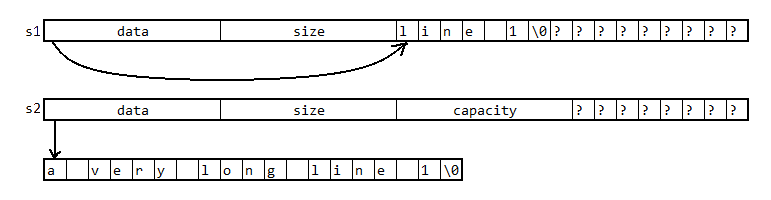

# SSO? SOS!

这是我在编写编译器的过程中遇到的一个让人拍案叫绝的陷阱。特此记录下来。

<!--truncate-->

## 问题

假设你正在编写源代码处理系统。你设计了这样一个函数和类：
```cpp
std::vector<std::string_view> splitLines(std::string_view view) {
    std::vector<std::string_view> lines;
    const char *p = view.begin(), *q = p, *r = view.end();
    while (q != r) {
        if (*q++ == '\n') {
            lines.emplace_back(p, q - 1);
            p = q;
        }
    }
    if (p != q) lines.emplace_back(p, q);
    return lines;
}

struct Source {
    std::vector<std::string> snippets;
    std::vector<std::string_view> lines;

    void append(std::string code) {
        snippets.push_back(std::move(code));
        for (auto line : splitLines(snippets.back())) {
            lines.push_back(line);
        }
    }
};
```

为了效率，你没有真的去分割字符串——而是利用 `string_view`，引用字符串中的一段作为一行，并把它们存入 `lines`。但是 `string_view` 并没有字符串的所有权，为了保证它引用的字符串不被回收，再使用 `snippets` 来保存这些字符串。如下图所示：


下面我们来试一试：

```cpp
int main() {
    Source source;
    source.append("ab\ncd\nef");
    for (auto line : source.lines) {
        std::cout << line << std::endl;
    }
}
```

输出：

```
ab
cd
ef
```

很好！

可是，当我们试图多次调用 append 的时候

```cpp
int main() {
    Source source;
    source.append("line 1");
    source.append("line 2");
    source.append("line 3");
    for (auto line : source.lines) {
        std::cout << line << std::endl;
    }
}
```

大跌眼镜的事情发生了：输出了一团乱码！

## 思考

输出乱码原因有哪些呢？你肯定已经想到了以下两种可能：

- `string` 管理的 `char[]` 被覆写或被释放了
- `string_view` 被修改了

先来测一下第一种可能

```cpp
int main() {
    Source source;
    source.append("line 1");
    source.append("line 2");
    source.append("line 3");
    for (auto const& snippet : source.snippets) {
        std::cout << snippet << std::endl;
    }
}
```

输出：

```
line 1
line 2
line 3
```

看上去字符串完好无损。

再来测测第二种可能

```cpp
int main() {
    Source source;
    source.append("line 1");
    for (auto line : source.lines) {
        std::cout << (void*) line.data() << ' ';
    }
    std::cout << std::endl;
    source.append("line 2");
    for (auto line : source.lines) {
        std::cout << (void*) line.data() << ' ';
    }
    std::cout << std::endl;
    source.append("line 3");
    for (auto line : source.lines) {
        std::cout << (void*) line.data() << ' ';
    }
}
```

输出：

```
0x26a40fc18e0
0x26a40fc18e0 0x26a40fc1c90
0x26a40fc18e0 0x26a40fc1c90 0x26a40fc1d00
```

`string_view` 也没有变化！

## 规律

你可能百思不得其解。先别急，我们再来做一个实验。

之前我们就发现，如果只 `append` 一次是没问题的。那么不妨测试一下乱码与 `append` 次数有没有什么关系。

```cpp
int main() {
    Source source;
    for (int i = 0; i < 10; ++i) {
        source.append("OOO");
        for (auto line: source.lines) {
            if (line == "OOO") {
                std::cout << line << ' ';
            } else {
                std::cout << "***" << ' ';
            }
        }
        std::cout << std::endl;
    }
}
```

输出：

```
OOO
*** OOO
*** *** OOO
*** *** OOO OOO
*** *** *** *** OOO
*** *** *** *** OOO OOO
*** *** *** *** OOO OOO OOO
*** *** *** *** OOO OOO OOO OOO
*** *** *** *** *** *** *** *** OOO
*** *** *** *** *** *** *** *** OOO OOO
```

这太有规律了！每次 `append` 乱码的 `string_view` 数量要么保持不变，要么就翻一倍，这似乎暗合了某个容器的某个特性。是的，`vector`。于是我们对前面的 `Source` 作出一点修改：

```
struct Source {

-   std::vector<std::string> snippets;
+   std::deque<std::string> snippets;
    
};
```

再执行上面的代码，输出：

```
OOO
OOO OOO
OOO OOO OOO
OOO OOO OOO OOO
OOO OOO OOO OOO OOO
OOO OOO OOO OOO OOO OOO
OOO OOO OOO OOO OOO OOO OOO
OOO OOO OOO OOO OOO OOO OOO OOO
OOO OOO OOO OOO OOO OOO OOO OOO OOO
OOO OOO OOO OOO OOO OOO OOO OOO OOO OOO
```

修复了！太棒了！

但，这应该不是 `vector` 的问题吧？

## 第三种可能

`vector` 在 `size > capacity` 的时候，会重新分配两倍的空间，并把原来的元素全部移动过去。但是移动的是 `string`，它管理的 `char[]` 难道也跟着发生了移动吗？还是说，发生的不是移动，而是复制？

带着这个疑问，我们再做一个实验：

```cpp
struct Observer {
    int i;
    Observer(int i): i(i) {
        std::cout << " make " << i;
    }
    Observer(Observer&& other) noexcept: i(other.i) {
        std::cout << " move " << i;
    }
    Observer(const Observer& other): i(other.i) {
        std::cout << " copy " << i;
    }
};

int main() {
    std::vector<Observer> observers;
    std::cout << "line 1: ";
    observers.emplace_back(1);
    std::cout << std::endl << "line 2: ";
    observers.emplace_back(2);
    std::cout << std::endl << "line 3: ";
    observers.emplace_back(3);
    std::cout << std::endl << "line 4: ";
    observers.emplace_back(4);
}
```

输出：

```
line 1:  make 1
line 2:  make 2 move 1
line 3:  make 3 move 1 move 2
line 4:  make 4
```

需要注意的是，`Observer` 移动构造器的 `noexcept` 是不可以省略的，否则它会优先选择复制构造器而不是可能抛出异常的移动构造器。

经过查询，我们可以确认 `string` 的移动构造器是 `noexcept` 的。可见发生的是移动而不是复制。

也就是说：我们移动了 `string`，而它管理的 `char[]` 也跟着移动了！为什么？

在引出今天的主角之前，我们再测试一个例子。`Source` 回退到未修复的版本，运行下面的代码：

```cpp
int main() {
    Source source;
    source.append("a very long line 1");
    source.append("a very long line 2");
    source.append("a very long line 3");
    for (auto line : source.lines) {
        std::cout << line << std::endl;
    }
}
```

输出：

```
a very long line 1
a very long line 2
a very long line 3
```

问题奇迹般的消失了。

## SSO

没错，这一切的罪魁祸首便是：短字符串优化（Short String Optimization，SSO）。

这是一种常见的字符串实现，被大部分的标准库（如 GCC libstdc++、Clang libc++、MSVC STL 等）采用。当字符串比较长的时候，字符串会被存在别处，并用 `string` 对象中的指针引用，如我们预料的一样；当字符串比较短的时候，字符串将直接存在 `string` 对象内部！

例如 libstdc++ 的实现如下图所示：

```cpp
std::string s1 = "line 1";
std::string s2 = "a very long line 1";
```



在这个实现中，短字符串优化的阈值是 15。末尾多余的一个字符用来存 0，来保证它同时是一个 C-Style String。此时 `capacity()` 永远返回 15。

综上所述，当字符串较短的时候，由它构造的 `string_view` 实际上是指向 `string` 自己（的一部分）的！那么当 `string` 本身被移走，它所在的位置被释放，`string_view` 自然而然就引用了一段非法的内存。`deque` 在插入新元素的时候不会移动旧元素，因此避免了这个问题。

## 后记

我实际上很早就了解过 SSO，但是实在没料到会以这样的形式遭遇，过程曲折离奇，叹为观止。只能说如果没有这个前置知识我可能还得埋头苦苦寻找原因很长时间。


