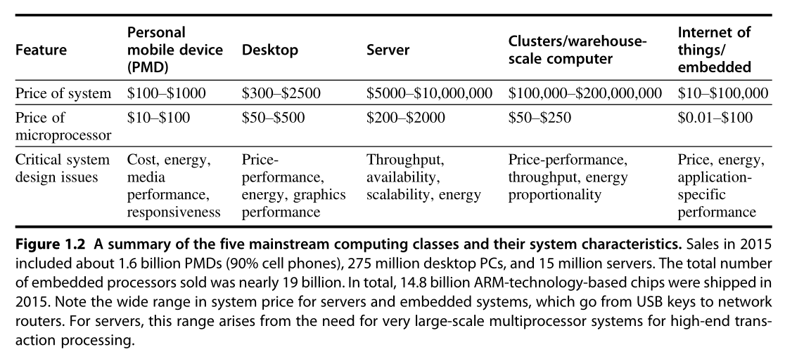
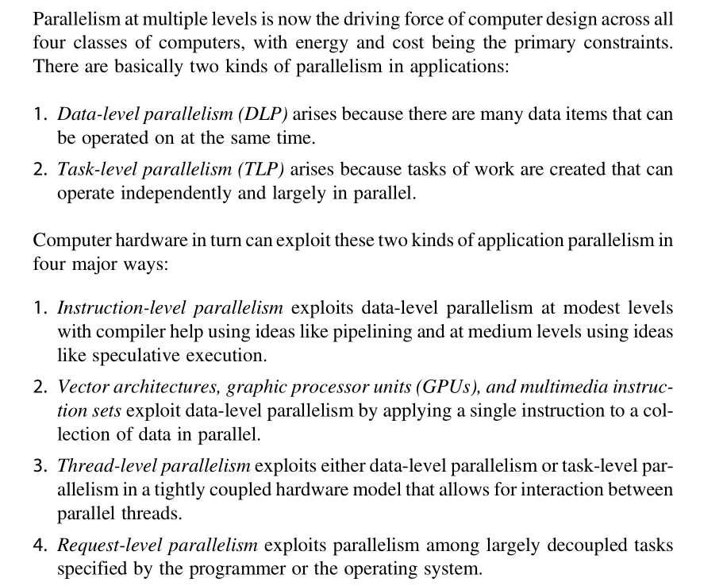
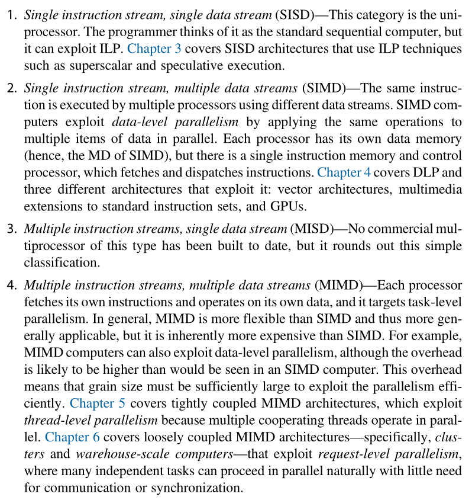
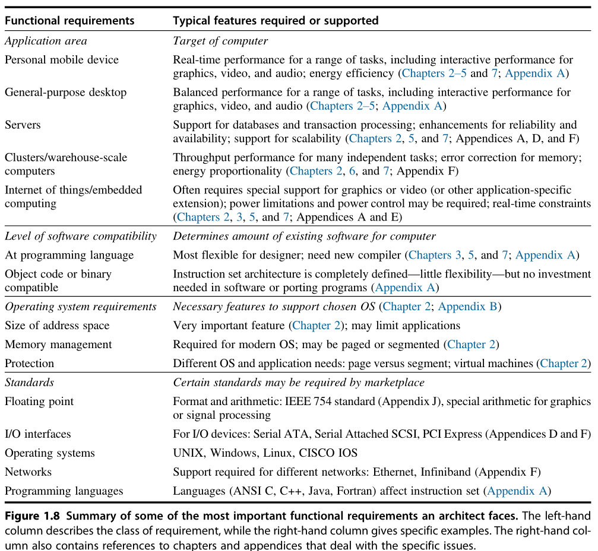

# Chapter 1 - Fundamentals of Quantitative Design and Analysis
## Classes of Computers

## Classes of Parallelism and Parallel Architectures

## Flynn's Classification of Parallelism

## Computer Architecture Design

## Quantitative Principles of Computer Design

- Take Advantage of Parallelism
- Principle of Locality
- Focus on the Common Case (Amdahl’s Law)

