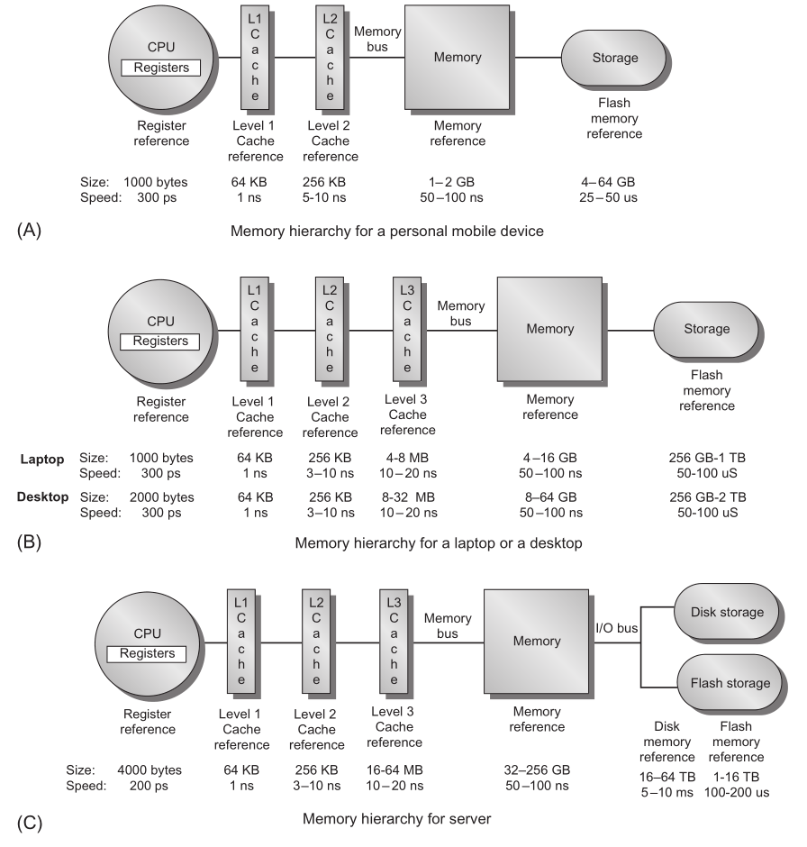
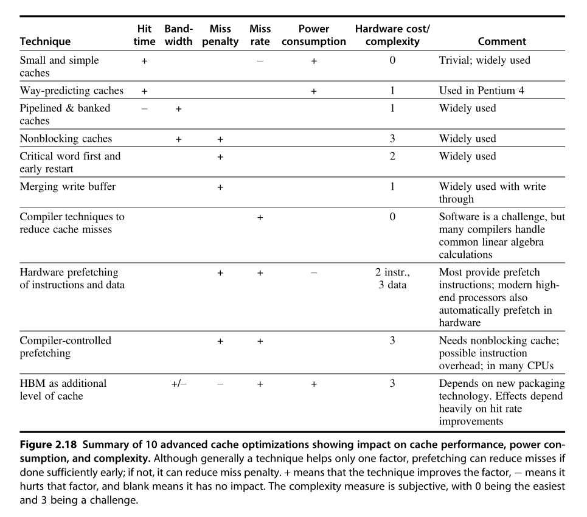
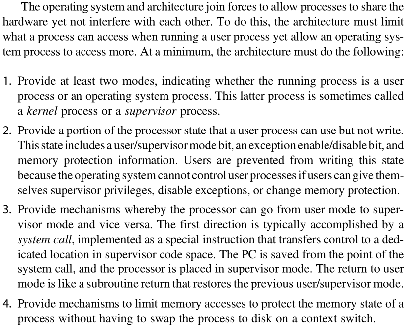
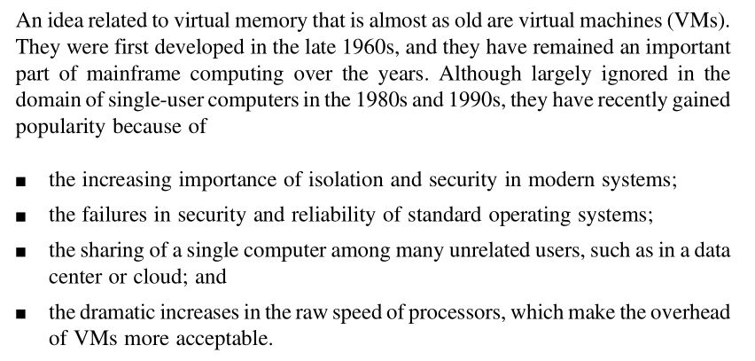

# Chapter 2 - Memory Hierarchy Design

## Memory Architecture

## Six Basic Cache Optimization

1. Larger block size to reduce miss rate
2. Bigger caches to reduce miss rate
3. Higher associativity to reduce miss rate
4.  Multilevel caches to reduce miss penalty
5. Giving priority to read misses over writes to reduce miss penalty
6. Avoiding address translation during indexing of the cache to reduce hit time

## Ten Advanced Optimizations of Cache Performance

### Five Categories

1. Reducing the hit time—Small and simple first-level caches and way-prediction. Both techniques also generally decrease power consumption.
2. Increasing cache bandwidth—Pipelined caches, multibanked caches, and non-blocking caches. These techniques have varying impacts on power consumption.
3. Reducing the miss penalty—Critical word first and merging write buffers. These optimizations have little impact on power.
4. Reducing the miss rate—Compiler optimizations. Obviously any improvement at compile time improves power consumption.
5. Reducing the miss penalty or miss rate via parallelism—Hardware prefetching and compiler prefetching. These optimizations generally increase power consumption, primarily because of prefetched data that are unused.

### Ten Optimizations

1. Small and Simple First-Level Caches to Reduce Hit Time and Power
2. Way Prediction to Reduce Hit Time
3. Pipelined Access and Multibanked Caches to Increase Bandwidth
4. Nonblocking Caches to Increase Cache Bandwidth
5. Critical Word First and Early Restart to Reduce Miss Penalty
6. Merging Write Buffer to Reduce Miss Penalty
7.  Compiler Optimizations to Reduce Miss Rate
8. Hardware Prefetching of Instructions and Data to Reduce Miss Penalty or Miss Rate
9. Compiler-Controlled Prefetching to Reduce Miss Penalty or Miss Rate
10. Using HBM to Extend the Memory Hierarchy

## Protection via Virtual Memory

## Protection via Virtual Machines

