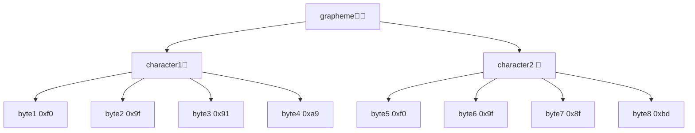
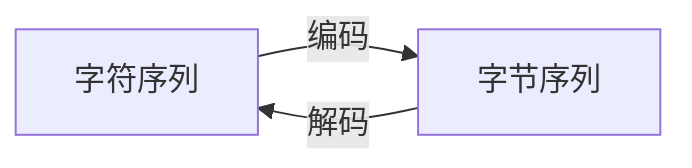

# 字符集与编码

:::warning
⚠️ 你先别急 ⚠️ 🚧 本文章仍在施工中 🚧
:::

## 字符集与编码是什么？

### 什么是字符集？

字符的集合就叫字符集（character set）。字符在字符集中分配的编号叫做码位（codepoint）。

例如 $S=\{\text{你,好,世,界}\}$ 就是一个只有四个字符的字符集。我们可以给这四个字符的分配码位 $0,1,2,3$，但码位的分配实际上不一定连续或从零开始，因此也可以是 $2,3,5,7$，或是任意四个互不相同的自然数。但要注意，字符相同，但是字符对应码位不同的字符集不是相同的字符集。

### 什么是编码？

字符集中的字符与字节（byte）序列之间的映射叫字符集的编码（encoding）。

例如 $f$ 将上面四个字符分别映射为 `0x00`、`0x01`、`0x02`、`0x03`，就可以称 $f$ 是字符集 $S$ 的一种编码。 

同一个字符集可以有多个编码方案。比如将这四个字符映射为 `0x00`、`0x01 0x00`、`0x01 0x01 0x00`、`0x01 0x01 0x01 0x00`。

上面的例子表明：

- 与字符建立映射的是字节序列，而不只是单个字节。
- 字符的码位和编码是两个不同的概念，但字符的码位可以作为编码的依据。
- 同一码位的字符在不同编码方案下得到的字节序列可能不同。

-----

可以看出，字符集和编码是**联系紧密**却**完全不同**的两个概念。

## 字符和字素是什么？

字符（character）是编码的最小独立单位。即对于字符序列 $c_1c_2\dots c_{n}$ 它编码后的字节序列应该是 $f(c_1)f(c_2)\dots f(c_{n})$。

字素（grapheme），又可译作字形，是文字、符号渲染的最小独立单位。

与日常生活中的定义不同，在计算机中，字符不一定是代表某个固定的字素的文字、符号，下面举两类例子说明。

### 控制字符

控制字符（control character）一般不会直接渲染出字素，但往往能改变其它字符的渲染行为，例如换行符、制表符、从右往左符等；或者帮助计算机对字符串进行识别，如 NUL、BOM 等。

### 组合字符

组合字符（combining character）可以与其它字符组合成一个字素。例如字素 Å，实际上是由字符 A 和组合字符  ̊ 组合而成。类似地，👩🏽 是由 👩 和 🏽 组合而成。你可以用 python 来简单验证这一点：

```python
>>> len("Å")
2
>>> 'A'+'̊'
'Å'
```

当组合字符紧随能与之组合的字符时，就可能被渲染器渲染为一个字素，且这样的组合是可以进行多次的。例如 👨‍❤️‍💋‍👨 = 👨+ZWJ+❤+VS-16+ZWJ+💋+ZWJ+👨。（没错，男男亲嘴）

上面的例子表明：一个字素可能包含多个字符。而一个字符又可以编码成多个字节，最后编码形成字节序列的过程可能如下图所示：



## 编码与解码

中文里，编码不仅是名词，也是动词。动词编码（encode）的反义词是解码（decode）。其反应的过程如下所示。



考虑到字符是编码的最小独立单位，因此编码器（encoder）只需要实现一个字符到字节序列的编码即可实现字符序列的编码。同理，解码器（decoder）也只需要解码出字节序列的首个字符即可实现字节序列的解码。

因此，当我们讨论编解码时，单个字符及其对应的字节序列，是我们关注的核心话题。

为了便于讨论，我们把字符序列编码后得到的字节序列称为字符串（string）。_字符串的长度（length）究竟应该是字节数，字符数，还是字素数？难说。_

