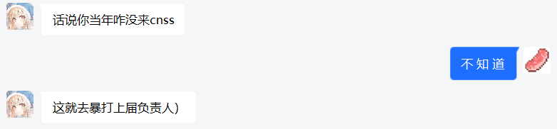
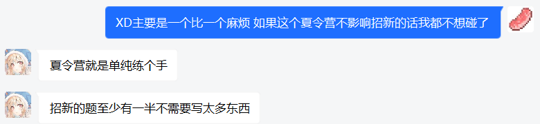

# 🖥️ CNSS Recruit 2022 Dev

Dev is so fun... functional!

~~XuKaFy 我想当你的狗 😍😍😍！为了你，我要 ak Dev！~~

## 一些感想

大一我什么都不知道。到了大一到大二的暑假，已是凝聚爷的 xlyke 才拉我进了 CNSS 招新群。毕竟是网安工作室，我最开始是想看看有没有适合我的 CTF 方向的。不过我注意到还有个 Dev 方向，自诩开发者的我当然要去看看。虽然看了，感觉很有趣，但由于嫌麻烦，加上不影响招新，我索性就没打，实在给人一种眼高手低的感觉：

但真正的旅程，还要 CNSS Summer Camp 后 **XuKaFy 作的讲座**说起。虽然只是评讲夏令营的题解，但 XuKaFy 的讲述极具启发性，常常引人入胜，如同醍醐灌顶。讲座看完，我沉浸在深深的震撼之中，仿佛从未真正涉足过开发，内心更是久久不能平静。这，也许就是真理的力量。因此如果要追究这次打比赛的根本原因的话，我会说是为了“追星”。**香肠至微至陋，决心要向 Dev 的高峰进发！**

在准备的一个月里，给我印象最深刻的就是《Structure and Interpretation of Computer Programs》。这是一部计算机科学的巨著，它用数学的角度审视了计算机程序的本质。不仅正文波澜壮阔，习题更是字字珠玑。**当数据与过程的界限变得模糊，抽象就是它们共同的语言！**我早就听闻 Lisp 等纯函数式语言，却从未真正理解函数式的精妙，直到此时才觉得相见恨晚。

招新开放当当晚，我兴高采烈的提交了我用类实现的 🌏 梦开始的地方，不紧不慢地开始写下一道题时，wp 居然被打了回来！当我看到不许用类的要求时，我开始狂笑：有意思，太有意思了！**这，就是我要打的比赛！**

第一周里，我就像磕了药一样，没日没夜地打。由于总是超额完成任务，我应该是额外加分最多的一个。期间我还重新认识了 syrinka——上行线路。他其实是老朋友了，却没有想到在 Dev 的比赛中再次相遇。**久旱逢甘露，他乡遇故知**，我重新找回了当年开发的热情，我重新认识了久违的老友，还有什么是比这更快乐的吗？

第一周结束时，Boss 题被放了出来。当我看到 [E] 题的时候，我直呼好家伙！我居然押中题了？这个比赛促使我迅速填完了我的编译器的坑。由于 SICP 实在让我着迷，我又去做了 [C]。注意到 [D] 似乎很简单，我也把它做了。当做我完三道 Boss 题的时候，比赛的性质就已经变了。最后两周时间，最后两道 Boss 题。**你问我为何攀登？因为它就在那里！**

很快我做完了 [A]，却收到一个惊天的噩耗：招新提前三天结束！不过事后证明，就算没有提前我也 ak 不了，[B] 果然是最难的一道，TDD 属实难绷。最后我只拿到了 30% 的分，也算是尽力了吧。

无巧不成书。在比赛的最后一天，我意外线下开盒了新生 Dev 的榜一。他甚至不知道我也在打 Dev！但其实巧合从一开始就注定了—— 拉我进招新群的 xlykle 和 Dev 方向的负责人 XuKaFy，**竟**都已成了我的同班同学。

放在过去，我可能很难相信现在的我会这样说：**这一个月，是我大学以来最开心的一个月。**付出是快乐的，收获也是快乐的；过程是快乐的，结果也是快乐的。笔下纵有千字，也道不尽香肠心中的无限感慨。最后只想感谢一路走来诸君的提携、指导、鼓励、陪伴，更感谢我自己的不懈努力。

## 题解说明

部分题解有扩展。部分题目、题解有删节。

题解多为我浅薄的思考，仅供参考，欢迎批评指正。

