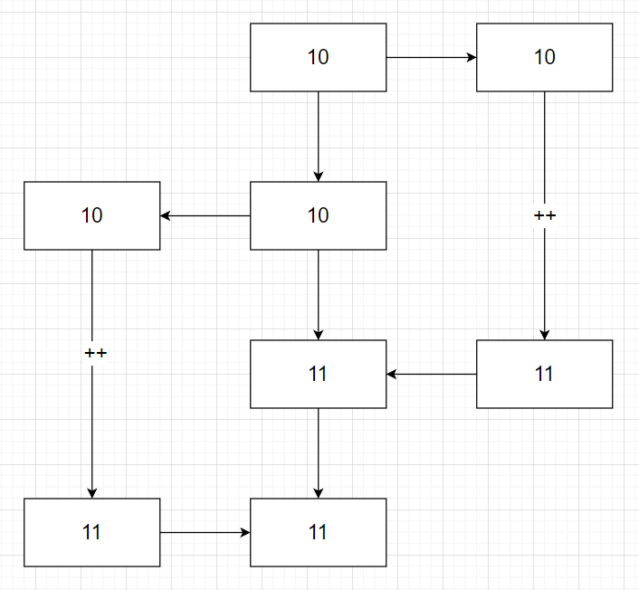

# 🗳 教我唱票

## 题目

XuKaFy 刚刚开始学习并发。他用 C 写了一个模拟唱票程序：

```C
// count.c
#include <stdio.h>
#include <stdlib.h>
#include <pthread.h>

volatile int counter = 0;
volatile int bucket[32768] = {0};

typedef struct {
    int count;
    int* start;
} Task;

void* fun(void* arg) {
    Task* task = (Task*) arg;
    for (int i = 0; i < task->count; ++i) {
        ++counter;
        ++bucket[task->start[i]];
    }
    return NULL;
}

int main(int argv, char* argc[]) {
    if(argv != 2) {
        printf("Usage: count <value>\n");
        return 0;
    }

    int n = atoi(argc[1]);
    if(n <= 0) {
        printf("Invalid value\n");
        return 0;
    }
    printf("n = %d\n", n);

    int* ticket = (int*) malloc(sizeof(int) * n);
    for (int i = 0; i < n; ++i) {
        ticket[i] = rand() % 32768;
    }

    Task t1 = {n / 2, ticket};
    Task t2 = {n / 2 + (n % 2), ticket + n / 2};
    pthread_t p1, p2;

    pthread_create(&p1, NULL, fun, (void*) &t1);
    pthread_create(&p2, NULL, fun, (void*) &t2);
    pthread_join(p1, NULL);
    pthread_join(p2, NULL);
    printf("Counter = %d\n", counter);

    int count = 0;
    for (int i = 0; i < 32768; ++i) {
        count += bucket[i];
    }
    printf("Count = %d\n", count);

    free(ticket);
    return 0;
}
```

其中，`n` 是真实票数，`Counter` 为两个线程加起来的唱票数，`Count` 为桶计数以后的票数。

当然，当 `n` 比较小的时候，XuKaFy 的唱票程序没有什么问题，直到某一天：

```
prompt> ./count 200000
n = 200000
Counter = 108201
Count = 199996
```

XuKaFy 极其不解，他又运行了几遍，发现似乎有这样一个规律：

$$
n \geq Count \geq Counter
$$

后来，XuKaFy 知道 `valgrind` 可以检查内存泄漏，然后就试了一下：

```
prompt> valgrind --leak-check=yes ./count 1000000
==837== Memcheck, a memory error detector
==837== Copyright (C) 2002-2017, and GNU GPL'd, by Julian Seward et al.
==837== Using Valgrind-3.15.0 and LibVEX; rerun with -h for copyright info
==837== Command: ./count 1000000
==837== 
n = 1000000
Counter = 1000000
Count = 1000000
==837== 
==837== HEAP SUMMARY:
==837==     in use at exit: 0 bytes in 0 blocks
==837==   total heap usage: 4 allocs, 4 frees, 4,001,568 bytes allocated
==837== 
==837== All heap blocks were freed -- no leaks are possible
==837== 
==837== For lists of detected and suppressed errors, rerun with: -s
==837== ERROR SUMMARY: 0 errors from 0 contexts (suppressed: 0 from 0)
```


虽然没有内存泄露，但是：

$$
n = Count = Counter
$$

请你解释解释为什么，并且帮 XuKaFy 改改代码。

## 题解

### 解释

自增时，变量先被从内存中复制到寄存器里，然后完成自增操作，再重新写回内存。当多个线程对同一个变量进行自增的时候，会出现下面这种情形：（图中左侧右侧为两个线程的寄存器，中间为共同操作的变量）




结果是：两次自增，变量却只加了一。自增得越频繁，这样的情况就会发生的越多。

对于 `counter` 来说，所有的票都会使它自增。但是对于 `bucket` 的每一个元素而言，只有部分的票会使它自增。后者自增没有前者那么频繁，所以最后 `counter` 发生上面情形的机会远高于所有 `bucket` 的元素之和。

由此可得：
$$
n \geq Count \geq Counter
$$

### 修改

使用了 C11 的 `_Atomic`。

```C
// modified count.c
#include <stdio.h>
#include <stdlib.h>
#include <pthread.h>

_Atomic int counter = 0;
_Atomic int bucket[32768] = {0};

typedef struct {
    int count;
    int* start;
} Task;

void* fun(void* arg) {
    Task* task = (Task*) arg;
    for (int i = 0; i < task->count; ++i) {
        ++counter;
        ++bucket[task->start[i]];
    }
    return NULL;
}

int main(int argv, char* argc[]) {
    if(argv != 2) {
        printf("Usage: count <value>\n");
        return 0;
    }

    int n = atoi(argc[1]);
    if(n <= 0) {
        printf("Invalid value\n");
        return 0;
    }
    printf("n = %d\n", n);

    int* ticket = (int*) malloc(sizeof(int) * n);
    for (int i = 0; i < n; ++i) {
        ticket[i] = rand() % 32768;
    }

    Task t1 = {n / 2, ticket};
    Task t2 = {n / 2 + (n % 2), ticket + n / 2};
    pthread_t p1, p2;

    pthread_create(&p1, NULL, fun, (void*) &t1);
    pthread_create(&p2, NULL, fun, (void*) &t2);
    pthread_join(p1, NULL);
    pthread_join(p2, NULL);
    printf("Counter = %d\n", counter);

    int count = 0;
    for (int i = 0; i < 32768; ++i) {
        count += bucket[i];
    }
    printf("Count = %d\n", count);

    free(ticket);
    return 0;
}
```

### valgrind

valgrind 的检查有效内存的原理是给可用地址打表。为了支持多线程，这个表是上了锁的。当访问某个地址的时候，valgrind 会去查这个表，表就被锁了，于是其他想要访问这个地址线程只能先等着。所以最后所有自增都有序进行，没有发生前面遇到的情况。
