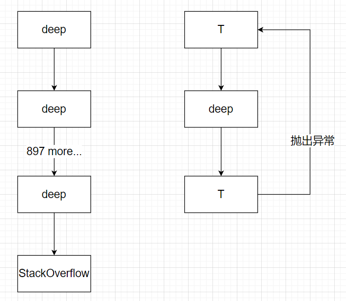

# 🐍 看看蛇

## 题目

```Python
import sys

class E(BaseException):  
  def __init__(self, args, kwargs):
    self.args = args
    self.kwargs = kwargs

def T(g):  
  def func(*args, **kwargs):
    f = sys._getframe()
    if f.f_back and f.f_back.f_back \
        and f.f_back.f_back.f_code == f.f_code:
      raise E(args, kwargs)
    else:
      while 1:
        try:
          return g(*args, **kwargs)
        except E as e:
          args = e.args
          kwargs = e.kwargs
  func.__doc__ = g.__doc__
  return func
```

这是一份 CPython 代码，请解释函数 `T` 的作用。

- 用自己的话，说说这段代码在干嘛
- 写一份利用 `T` 函数完成功能的示例代码，最好能和不用 `T` 的版本进行功能或性能比较
- 说说这种技术的应用场景
- 说说你对 CPython（或者其他语言）暴露底层设计的态度

## 题解

### 这代码在干嘛

一句话：尾递归优化。

函数 `T` 可以作为装饰器修饰其它函数，例如：

```Python
@T
def deep(a):
    if a == 0:
        return "message from deep recursive"
    return deep(a - 1)


print(deep(1000))
```

如果没有`@T`，将会超出 Python 的栈限制（默认为 900 层），加了之后可以正确返回结果。副作用是，一旦发生递归调用，将会跳过之后的代码，直接把递归的调用的结果作为当前函数返回。（实际上是强制任意递归变为尾递归）

尾递归优化的原理如下图所示：（左侧为未装饰情形，右侧为装饰后情形）



可以看到右侧的栈最多只有三层深，大大节省了栈空间。

但是缺点也是显而易见的，由于使用异常，函数递归的效率大大降低了：

```Python
def deep(a):
    if a == 0:
        return "message from deep recursive"
    return deep(a - 1)


print(timeit.timeit(lambda: deep(900), number=10000))
deep = T(deep)
print(timeit.timeit(lambda: deep(900), number=10000))
```

输出：

```
0.6699371
9.7430404
```

可以看到后者比前者慢很多。

### 应用场景

Python 是很依赖装饰器来表达一些高级抽象的，比如属性功能：

```Python
class Student:
    def __init__(self):
        self._age = 0


    @property
    def age(self):
        print("getter")
        return self._age


    @age.setter
    def age(self, value):
        print("setter")
        if value == 24:
            print("24 岁，是学生")
        self._age = value


student = Student()

student.age = 23
student.age += 1
```

输出：

```
setter
getter
setter
24 岁，是学生
```

这样可以大大简化面向对象的 setter/getter 模型，例如这里的`+=`运算符实际上被展开成了多个步骤，如果不借助这个特性，相同的功能可能会被表达为：（这种情况在 Java 下非常多见）

```Java
student.setAge(student.getAge() + 1);
```

显得十分冗长。

### 底层暴露

底层暴露是一把双刃剑。

一方面，它会给予程序员极大地灵活性，运用底层的特性，实现某种更深层的优化或者更高级的抽象、制作某种语法糖、绕开某种语法限制、获取额外的信息等等。

另一方面，这种特性作为“黑魔法”，十分容易被滥用、误用，进而导致代码可读性和安全性的降低。更糟糕的是，一旦涉及底层特性，调试的难度和可能造成的危害也会大大增加。

因此我认为，底层特性应该作出一些适当的暴露，而与此同时一些门槛也是必要的，这里的例子是，`_getframe()`函数是用下划线开头的，暗示了它不应该被广泛使用。

再比如 Java，Java 的底层暴露做的非常有限，反射算是一例。原本的设计，应该说兼顾了安全和灵活，同时也是有多级门槛的。但是近年来限制越加越多，导致效率和灵活性大大降低，作为 modder 我非常不喜欢 :facepunch: 。

Js 和 Python 大概属于比较自由的，但是 Js 比 Python 更加奔放，很难不让人望而生畏。