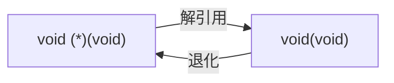
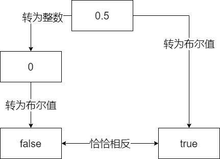

# 隐式转换

类型系统帮助我们识别数据，是 C 语言非常重要的部分。但作为一个强类型的语言，比起显式的类型转换，C 语言程序中却更多充斥着隐式转换（implicit conversion）。这样的转换，在悄无声息间发生，为程序员对程序的编写和识别带来了很大的便利，也造成了很大的困扰。

在开始之前，我们先了解一个事实：在 C 语言里面，字符常量是`int`类型的，而 C++ 里才是`char`类型的。假设`int`有 32 位，那么

```C
printf("%zu", sizeof 'a'); // C 输出 4，C++ 输出 1
```

这里不是什么隐式转换所致，它本来就是这样。请勿与后面讲到的提升混淆。

## 转换情形

隐式转换包括以下三类：

1. 赋值、初始化、传参、返回，称为如同赋值的转换。
2. 可变参数提升。
3. 算术转换（提升、共同类型）。

这里第一类里面说的传参特制的带类型的参数的传参（如`printf`的第一个参数），对于不带类型的可变参数（如`printf`的后续参数）是算作第二类里的。同样的，算术运算中的提升算作第三类，而可变参数中的提升算作第二类。

下面我具体说说哪些是值得注意的。

## 指针

### `void*`的隐式转换

C 语言`void*`类型的指针隐式转换为任意类型的指针，这主要是为了方便下面这样的代码：

```C
int* p = malloc(sizeof(int)); // malloc returns void*
int* q = calloc(10, sizeof(int)); // calloc returns void*
```

然而这样做带来的危险也显而易见——如果你没有那么容易观察到你需要的类型和你有的类型，就可能不知不觉间造成谬误：

```C
void f(double* np);
// 一万行代码
int a;
// 一万行代码
void* p = &a;
// 一万行代码
f(p); // Oops
f(malloc(sizeof(int))); // Oops
```

好在 C++ 不允许这么做——如果你想提高你的代码的可读性和可移植性性，你最好加上显式的转换。

### 空指针

C 语言定义了宏`NULL`，用它来表示空指针。两种典型的实现是

```C
#define NULL 0
#define NULL ((void*) 0)
```

第二种看上去可能更合理一些。然而，由于上面提到的原因，第二种是不兼容 C++ 的。因此一般采用第一种。

这给我们带来一个非常反直觉的结论：绝大多数地整数都不允许被隐式转换为指针的情况下，有着唯有一个例外——0！而且这个 0 还不能是普通的 0，必须是常数 0！更让人反直觉的是，在这种情况下，空字符 NUL（即`'\0'`，别忘了它的类型可是`int`哦）和空指针 NULL 已然是完全等价的了，真不可不让人感叹大自然的鬼斧神工。

### 退化

退化（decay）说的是两件事情：

1. 数组转换为指向数组首元素的指针
2. 函数转换为指向函数自己的指针

因此，数组名称从不是指向数组首元素的指针，除非它发生了退化：

```C
int a[10];
printf("%d\n", sizeof (a));     // 输出 sizeof(int) * 10
printf("%d\n", sizeof (a + 0)); // 输出 sizeof(void*)
printf("%d\n", sizeof (+a));    // 仅 C++ 允许，输出 sizeof(void*)

int *p1 = a; // 指向数组首元素 a[0] 的指针
int (*p2)[10] = &a; // 指向整个数组 a 的指针
```

下面的代码可能不会像其它语言那样把整数连接到字符串后面，而是让字符串字面量退化为指针后进行偏移。如果没有超过字符串的范围，你会发现剩下的字符序列仍然能够构成字符串。

```C
puts("hello" + 2); // 输出 "llo"
```

不过函数由于退化成指向自己的指针，显得就没那么严格：

```C
void f(void);
void (*fp)(void) = f; // f 从 void(void) 退化为 void(*)(void)
fp(); // 简略形式：OK
(*fp)(); // 标准形式：OK
(*****fp)(); // 反复解引用成函数再退化回函数指针指针
```

最后一行可能令人略感疑惑，它实际上反复发生了如下的转换：



## 布尔类型

布尔类型是 C99 才加入 C 的，但是这样的转换一直都存在，那就是当上下文需要一个布尔值时（例如分支和循环的条件之中，逻辑运算符`&&`、`||`两侧和`!`运算符后面等），算术类型就会隐式转换为布尔值（真或假）来参加运算。

在学习 C 之初，我们就接触到一个概念：在整数转为布尔值的时候，零为假，非零为真，而反过来转换的时候呢，假为零，真为一，是不对称的。但是别忘了，算数类型不仅包括整型，还有浮点型。浮点数在转换为布尔值的时候，同样遵守零为假，非零为真的原则。这本来是无可厚非的。但是，实践中许多人、许多代码都偏爱于使用`int`来表示布尔值（这大概是因为 C99 之前没有`bool`的缘故）。因此要注意下面这样的情况：

```C
double d = 0.5;
int i = d;
bool b = d;
if (i && b) // 假！
    ...
```

第一眼：怎么会是假呢，这俩不是源于一个浮点数吗。再一想：啊！原来如此：



总的来说，加一个`!= 0`是避免二义性最有效的方法。但还是那句话，别忘了加括号。

## 整数类型

任何两个整数类型之间都可以互相隐式转换。

如果目标类型可以表示原值，则值不变。如果不行，那么：

- 如果目标类型是无符号数，则值会被取这个类型的最大值加一的摸，使得这个值能放入这个类型中。

- 如果目标类型是有符号数，结果是实现定义的。C++20 之后，有符号数按照无符号数的方式处理。

实现定义的原因不难理解：毕竟有符号数怎么实现的也是实现定义的。好在我们通常不需要担心这个问题，如同[这里](int.md#有符号数的实现)说的那样。

## 浮点类型

虽然浮点数表示的数范围比整数更大，但是精度上却并非如此：

```C
float f = 20000001; // x = 20000000
```

也就是说，`int`和`float`之间的相互转换，都是会丢失精度的。此时此刻，如果你对`f`进行自增，将不会有任何作用。

好在，`int`的所有值都可以用`double`精确表示。这也是从`int`到`double`的转换不被认为会丢失精度的原因。

与不痛不痒的整型溢出不同，当整型与浮点数之间的转换涉及溢出的时候，意料之外的事情往往会发生：

```C
int i = 1e10F; // UB for 32-bit int
float f = 1 + (long long)FLT_MAX; // UB
```

即使是浮点数之间的转换，溢出同样是危险的：

```C
float f = 2 * (double)FLT_MAX; // UB
```

当然，最恶名昭著的还是二进制浮点数无法精确表示十进制小数的问题：

```C
double d = 0.1; // d = 0.1000000000000000055511151231257827021181583404541015625
float f = d;    // f = 0.100000001490116119384765625
0.1 + 0.2 == 0.3; // 假！
```

在这里，你要认识到，你所看到的这些字面量的精确值，从未真正的在计算机中存在过。你可以把它们作为“离这个数最近的浮点数”的一个标志，但你休想真正的得到这个数字的精确值本身。

这就是为什么在统计和处理财务数据的时候，是不可以使用二进制浮点数的。

## 提升和共同类型

提升（promotion）和共同类型（common type）作为最常见的隐式类型转换，无时无刻不在影响着程序的走向。

在这一节，为了讨论方便，我们作出一些假定。这些假定完全是为了叙述方便，而不是标准。注意`sizeof(char) == 1`不需要假定，因为这是必须的。

| `T`                    | `sizeof(T)` |
| ---------------------- | ----------- |
| `short`                | 2           |
| `int`，`long`和`float` | 4           |
| `long long`和`double`  | 8           |

### 浮点数的提升

为什么在`scanf`里，`"%f"`和`"%lf"`分别指代`float`和`double`，不可以混淆，而在`printf`中却无所谓？原因是，在可变参数传递的时候，发生了类型的提升，一切的`float`都会被提升为`double`传递。而`scanf`接受的是`float*`和`double*`（你不会又忘了取地址吧），就不会进行这样的提升。

例如下面这个例子中，已知`3.14F`在内存中的表示和`1078523331`一致。由于类型的提升，#1 处传入的`float`被提升为了`double`，从而二进制的形式发生了巨大的改变，而#2，虽然传入的`int`不需要进行提升，但是`%g`期望的是读取一个提升之后的`double`而不是提升前的`float`，因此最后读取到的内容也完全不同。

```C
float f = 3.14F;
int i = *(int*)&f; // i = 1078523331
printf("%d\n", f); // #1 输出 1610612736
printf("%g\n", i); // #2 输出 5.32861e-315
```

换成`long long`和`double`，由于不存在类型提升的问题，因此结果就完全符合预期了。

```C
printf("%lld\n", 3.14); // 输出 4614253070214989087
printf("%lg\n", 4614253070214989087LL); // 输出 3.14
```

综上，浮点数的提升一句话就说完了：在可变参数列表中，`float`会被提升为`double`。

### 浮点数的共同类型

在浮点运算中，遵循相同保持不变、谁大转成谁、整数向浮点数靠拢的原则：

```C
printf("%d\n", sizeof(1.0F + 1.0F)); // 输出 4
printf("%d\n", sizeof(1.0D + 1.0F)); // 输出 8
printf("%d\n", sizeof(1 + 1.0F));    // 输出 4
printf("%d\n", sizeof(1 + 1.0D));    // 输出 8
```

请注意浮点数提升只在可变参数情况下发生，在常规运算中均为找共同类型。

### 整型的提升

```C
short x = 32767;
printf("%d\n", sizeof (x));		// #A 输出 2
printf("%d\n", sizeof (+x));	// #B 输出 4
printf("%d\n", x + 1); 			// #1 输出 32768
printf("%d\n", x + (short)1); 	// #2 输出 32768
printf("%d\n", (short)(x + 1)); // #3 输出 -32768
printf("%hd\n", x + 1); 		// #4 输出 -32768
```

虽然 #A #B 仅仅相差一个`+`，可是类型已经悄然从`short`提升到了`int`。#2 处，即时两个操作数都是`short`，也被提升为了`int`。这表明：不仅是在可变参数列表中，在任何的算术运算中，只要整数的类型大小小于`int`，都会被提升到`int`。

注意，这样的提升是无视符号性（signedness）的，也就是是说`unsigned char`和`unsigned short`经过提升之后还是会得到`int`（对于后者来说，除非`short`和`int`一样大——这在 16 位的机器上比较常见——那么会被提升到`unsigned int`）。

注意，#1~#4 中的加法，两侧的操作数都是先提升到`int`之后在进行计算的，所以它们的共同类型自然而然是`int`。但如果提升之后，类型仍有所不同，又该如何呢？

### 整型的共同类型

开始之前我们先定义一下整数类型的阶（rank），注意我们这里说的阶指的是它的地位而不是实际的`sizeof`大小。

对于有符号数：`signed char < signed short < singned int < signed long < signed long long`

无符号数同理，只需要把`signed`换成`unsigned`即可。


对于两个不同的类型，他们的共同类型是：

1. 如果两个类型的符号性相同（就是说，都是无符号或都是有符号），那么它们的共同类型即为高阶的那一个。
2. 否则，如果无符号数比有符号数高阶或同阶，有符号数会被转换为无符号数。
3. 否则，如果有符号数能装下无符号数所有值，无符号数会被转换为有符号数。
4. 否则，两个都会被转换为有符号类型（即高阶的那个类型）的无符号版本。


我们来看几个例子（阅读前请回顾一下本节开头的假定及其注意事项）

```C
(char)'a' + 1L
```

首先，`'a'`是`int`的（忘了吗？看看本章开头），然后被转为`char`，接着被提升为`int`。因为两侧都是`signed`的，属于情况 #1，所以直接取高阶者，即将左侧的`int`转为`long`。最后的结果是`98L`。

```C
2U - 10
```

两侧符号性不同，且同阶，属于情况 #2，所以有符号数转换为无符号数，即`2U - 10U`。最后的结果为`4294967288U`。

```C
0UL - 1LL
```

两侧符号性不同，且有符号数可以装下无符号数的所有情况，所以无符号数会被转换为有符号数，即`0LL - 1LL`。最后的结果为`-1LL`。

```C
0U - 1L
```

两侧符号性不同，且有符号数不可以装下无符号数的所有情况（因为`sizeof(int) == sizeof(long)`，所以`UINT_MAX > INT_MAX = LONG_MAX`），所以两个都会被转换为有符号类型（即高阶的那个类型）的无符号版本，即`0UL - 1UL`。最后的结果为`4294967295UL`。

你可能注意到了，最后那种最怪最怪的规则，是针对 C 语言特色的，两个不同阶整数类型大小相同而设计的，可谓用心良苦。（实际上前面提到提升的时候也提到了`short`和`int`也可能存在这种情况）

-----

提升和共同类型的复杂规则主要体现在符号性的处理上。下面分别介绍两个典型的提升和共同类型的陷阱。

### 陷阱：提升

```C
char readByte();
signed int i = readByte(); // 小心！
unsigned int u = readByte(); // 小心！
```

这里`readByte`函数返回了`char`，他很可能是一个有符号数（当然，也有可能是无符号数，参见整数那章），那么如果它返回的字节实际上的内容是`255`，这里就被讹为`-1`了，那么`i`的值就成了`-1`，而`u`的值就成了`4294967295U`（即`(unsigned int)-1`）。这无疑是非常糟糕的。在 Java 这样自诩清高，宁可删掉无符号数来解决无符号数带来 bug 的语言里来说，更为棘手。

解决方案一：改用无符号的函数返回类型

```C
unsigned char readByte();
```

解决方案二：手动转为等大无符号类型

```C
signed int i = (unsigned char) readByte(); // i = 255
unsigned int u = (unsigned char) readByte(); // u = 255U
```

解决方案三：（适合于 Java 这种没有无符号数的语言）

```Java
int i = readByte() & 0xFF;
```

在 Java 里整数类型照样会提升，不过`& 0xFF`很好的帮我们解决了这个问题：因为无论如何，整数在提升的时候，低位是不变的。高位视正负和目标类型的符号性来填充 0 或者 1。因此这里我们直接取出低位，也就是原来的字节的内容。

### 陷阱：共同类型

```C
unsigned int i = 1;
if (-1 < i) // 假！
	...
```

问题就出在，两侧的共同类型是`unsigned int`，也就是说，左边的`-1`将会被转换为无符号数再与`i`比较，一种典型的等价形式就是`4294967295u < i`，而这显然是假的！解决方法是，将`i`也转换为有符号数再进行比较。

可能在这里还比较明显，如果把变量`i`换成`sizeof(int)`，你还能看出来吗？没错，`sizeof`的返回类型`size_t`，恰好就是一个无符号类型。推而广之，不管是 C 语言的`strlen`函数，还是 C++ 的容器的`size()`函数等，都是返回的是`size_t`。无符号数到处有，需要我们时时警惕。

### 启示录

可以看出，潘多拉的魔盒正是符号性，这样看来 Java 删去无符号数或许也有一定道理。解决这个问题的办法就是：无论进行什么运算的时候，一定要注意两边操作数整数的符号。最妥当的方法就是：保证两侧的符号性相同。这样转换就仅仅只会发生在整数大小之间。此外，还是那句话，在涉及位运算时，统统使用无符号整数，会省去不少的麻烦。
