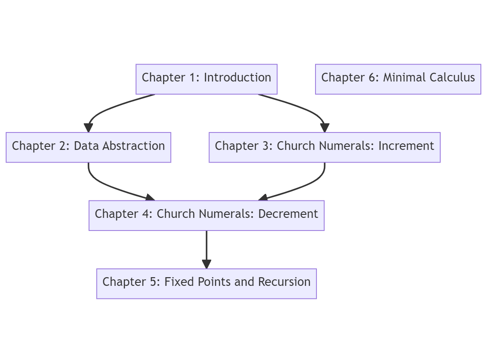

# Introduction to Lambda Calculus

## Alonzo Church - Founder of Lambda Calculus

## Catalogue

## Reference

- https://brilliant.org/wiki/lambda-calculus/
- _Structure and Interpretation of Computer Programs_
- [SKI Calculus from Wikipedia](https://en.wikipedia.org/wiki/SKI_combinator_calculus)
- [BCKW System from Wikipedia](https://en.wikipedia.org/wiki/B,_C,_K,_W_system)
- [Iota Calculus from Wikipedia](https://en.wikipedia.org/wiki/Iota_and_Jot)

